# Hazel 游戏引擎笔记 009：事件系统

> 本节来源：[The Cherno 游戏引擎系列第 9 讲“事件系统”](https://www.bilibili.com/video/BV1wtLazEEmC/?p=9)，时长约 35 分 40 秒。  
> 原课程与 Hazel 代码作者：The Cherno。代码参考提交：[`34df416`](https://github.com/TheCherno/Hazel/tree/34df41651fe88041540f20df845a70642359dc17)。  
> 本文由视频字幕重构、翻译并整理，不是官方教材；术语和代码以原视频及同期 Hazel 仓库为准。

## 本节目标

上一讲完成了事件系统的设计，这一讲开始把设计真正落进 Hazel。由于事件系统涉及的文件和代码量较大，Cherno 改变了系列视频的组织方式：不再从零逐行敲出全部实现，而是把开发分支中已经使用和验证过的代码合并到公开仓库，再通过代码差异逐一解释。

这种形式把注意力从“如何打字”转向“为什么这样设计”。本节最终会得到一套可运行的阻塞式事件系统，包括：

- `Event` 基类与事件类型、事件分类元数据；
- 键盘、鼠标和应用程序事件的具体类型；
- 用于减少重复代码的事件宏；
- 根据事件类型自动调用处理函数的 `EventDispatcher`；
- 与日志系统、Premake 和应用程序入口的集成；
- 一个创建、分类和记录 `WindowResizeEvent` 的基础测试。

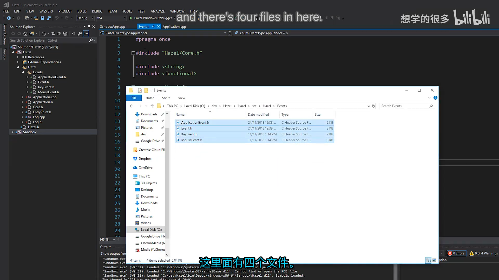

## 1. 为什么需要事件系统

 *(参考时间: 00:04:49)*

游戏引擎中的窗口、输入设备、渲染器和游戏逻辑经常需要互相通知状态变化，但各模块又不应该彼此紧紧绑定。事件系统提供了一个中间的、统一的通知接口：产生事件的模块只负责描述“发生了什么”，接收方再决定是否关心以及如何处理。

本节实现的是**阻塞式事件系统**：

- 事件发生后立即分发，不进入队列，也不延迟到下一帧；
- 一旦事件被处理，当前调用链必须马上完成对应工作；
- 事件可以被标记为“已处理”，避免继续传播给下层；
- 未来可以选择改造成事件总线或缓冲队列，但当前版本优先保持简单直接。

阻塞式设计并不意味着事件无法被“消费”。例如当界面按钮收到鼠标点击并确认鼠标位于按钮范围内时，它可以把事件标记为已处理，阻止游戏世界再次收到同一次点击。

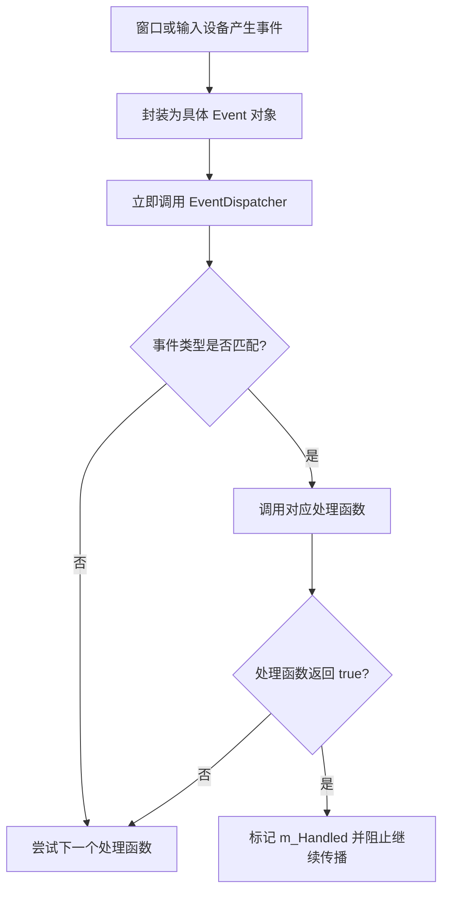

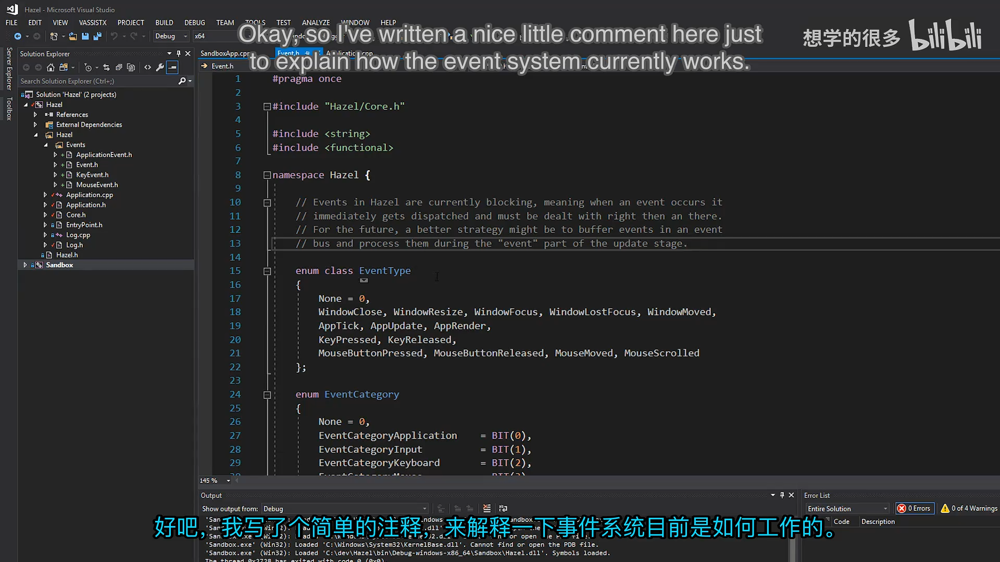

## 2. 事件元数据：类型与分类

事件系统位于 `Hazel/src/Hazel/Events`，主要有四个文件：

- `Event.h`：事件系统核心，包含事件基类、类型枚举、分类位标志和分发器；
- `ApplicationEvent.h`：窗口关闭、窗口缩放、应用 tick/update/render 等事件；
- `KeyEvent.h`：按键按下、按键释放以及共享的按键基类；
- `MouseEvent.h`：鼠标移动、滚轮、按键按下和释放事件。

### 2.1 EventType 用来判断“这是什么事件”

`EventType` 为每一种具体事件分配稳定的整数标识。分发器不需要使用 `dynamic_cast` 或运行时类型信息，只要比较这个标识，就能知道事件属于哪个具体类型。

```cpp
enum class EventType
{
    None = 0,
    WindowClose, WindowResize,
    WindowFocus, WindowLostFocus, WindowMoved,
    AppTick, AppUpdate, AppRender,
    KeyPressed, KeyReleased,
    MouseButtonPressed, MouseButtonReleased,
    MouseMoved, MouseScrolled
};
```

视频里特别指出，鼠标滚动等事件之所以已经出现在代码中，是因为这份实现来自长期使用的开发分支；它比现场临时设计的原型更成熟，也更容易覆盖真实输入场景。

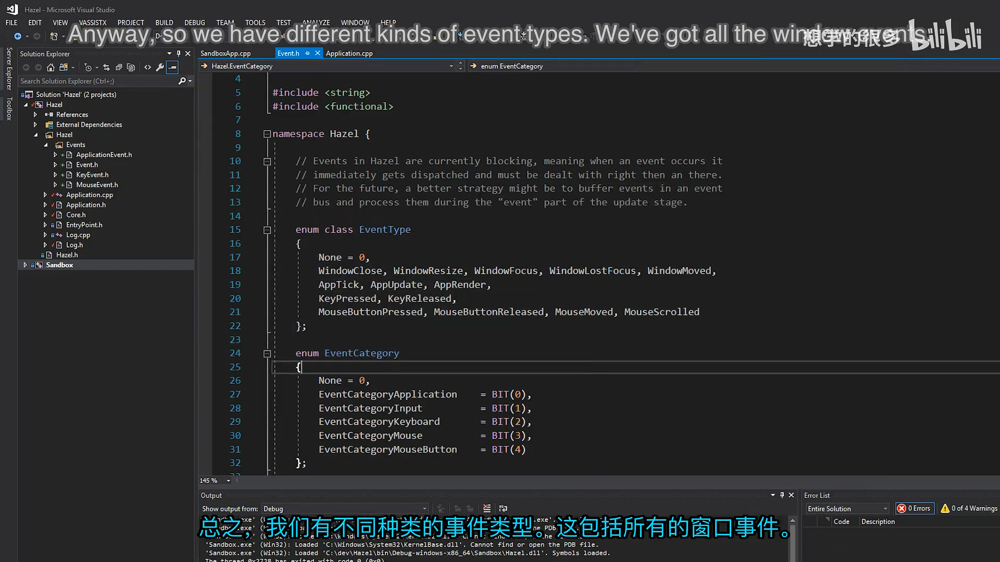

### 2.2 EventCategory 用来判断“我是否关心这一类事件”

仅靠具体类型过滤会非常繁琐。例如一个模块想记录所有鼠标事件，却不想同时写出鼠标移动、滚轮、按钮按下和按钮释放四种判断。事件分类提供了更粗粒度、也更符合调用方意图的过滤方式。

分类采用位字段，而不是连续的 `0、1、2、3`。这样同一种事件可以同时属于多个分类：

- 按键事件既属于 `Keyboard`，也属于 `Input`；
- 鼠标事件既属于 `Mouse`，也属于 `Input`；
- 鼠标按钮事件还可以同时属于 `MouseButton`；
- 窗口缩放和关闭事件属于 `Application`。

```cpp
#define BIT(x) (1 << x)

enum EventCategory
{
    None = 0,
    EventCategoryApplication = BIT(0),
    EventCategoryInput       = BIT(1),
    EventCategoryKeyboard    = BIT(2),
    EventCategoryMouse       = BIT(3),
    EventCategoryMouseButton = BIT(4)
};
```

判断分类时只需要进行按位与运算：

```cpp
inline bool IsInCategory(EventCategory category)
{
    return GetCategoryFlags() & category;
}
```

结果为零表示不属于该分类；任何非零值都表示至少属于该分类。事件当然可以同时属于更多分类。

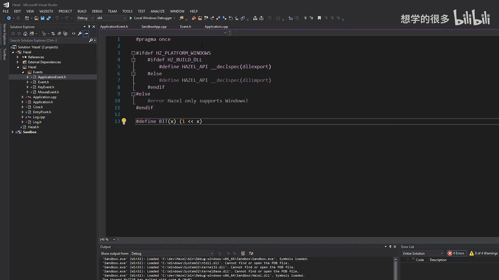

## 3. Event 基类

`Event` 是所有具体事件的公共基类，主要承担三类职责：

1. 暴露事件类型、名称和分类查询接口；
2. 保存 `m_Handled` 状态，支持事件消费和传播控制；
3. 提供默认字符串输出，必要时允许具体事件补充详情。

```cpp
class HAZEL_API Event
{
    friend class EventDispatcher;
public:
    virtual EventType GetEventType() const = 0;
    virtual const char* GetName() const = 0;
    virtual int GetCategoryFlags() const = 0;
    virtual std::string ToString() const { return GetName(); }

    inline bool IsInCategory(EventCategory category)
    {
        return GetCategoryFlags() & category;
    }

protected:
    bool m_Handled = false;
};
```

### 3.1 纯虚接口保证每种事件都完整

`GetEventType`、`GetName` 和 `GetCategoryFlags` 是纯虚函数。任何可以直接实例化的事件类型都必须提供这些信息，否则无法通过编译。

`GetName` 返回的是 `const char*`，并不是动态分配的字符串。事件名称主要服务于调试和日志，不应出现在游戏运行时的热路径中。

### 3.2 ToString 是调试接口

默认实现只返回事件名称。带数据的事件可以重写它，让日志包含更有诊断价值的信息：

- `WindowResizeEvent` 输出新的宽度和高度；
- `KeyPressedEvent` 输出键码和重复次数；
- `MouseMovedEvent` 输出鼠标坐标；
- `MouseScrolledEvent` 输出水平和垂直滚动偏移。

格式化会使用 `std::stringstream`，可能发生内存分配，因此它只应该用于排错，不应该成为游戏运行逻辑的一部分。


## 4. 具体事件类型

### 4.1 键盘事件与按键重复

键盘事件有一个共同数据：按下的键码。因此代码先建立 `KeyEvent` 基类保存 `m_KeyCode`，再由 `KeyPressedEvent` 和 `KeyReleasedEvent` 派生。

`KeyEvent` 的构造函数是 `protected`，表示它可以作为继承层次中的公共实现，但不应被直接实例化。

```cpp
class HAZEL_API KeyEvent : public Event
{
public:
    inline int GetKeyCode() const { return m_KeyCode; }

    EVENT_CLASS_CATEGORY(EventCategoryKeyboard | EventCategoryInput)
protected:
    KeyEvent(int keycode)
        : m_KeyCode(keycode) {}

    int m_KeyCode;
};
```

按键按下事件还保存 `repeatCount`：

```cpp
class HAZEL_API KeyPressedEvent : public KeyEvent
{
public:
    KeyPressedEvent(int keycode, int repeatCount)
        : KeyEvent(keycode), m_RepeatCount(repeatCount) {}

    inline int GetRepeatCount() const { return m_RepeatCount; }

    EVENT_CLASS_TYPE(KeyPressed)
private:
    int m_RepeatCount;
};
```

`repeatCount == 0` 表示用户刚刚按下按键；随后系统可能继续发送重复事件。这个差异对菜单选择非常重要：若只处理第一次按下，用户按住方向键时可能只移动一次；若不加区分地连续处理，按住键又会高速循环。

利用重复计数，可以明确区分“开始移动”和“连续移动”，或在菜单中等待系统自带的首次重复延迟。视频中的终端演示清楚地展示了：第一次出现字母 `A` 后有一次停顿，随后才出现连续重复。

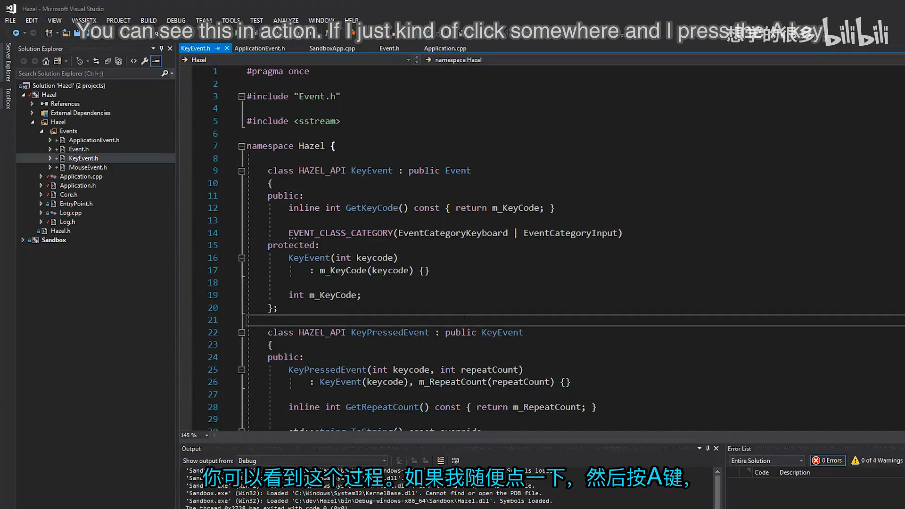

`KeyReleasedEvent` 的结构更简单，只需要记录哪一个键被释放：

```cpp
class HAZEL_API KeyReleasedEvent : public KeyEvent
{
public:
    KeyReleasedEvent(int keycode)
        : KeyEvent(keycode) {}

    EVENT_CLASS_TYPE(KeyReleased)
};
```

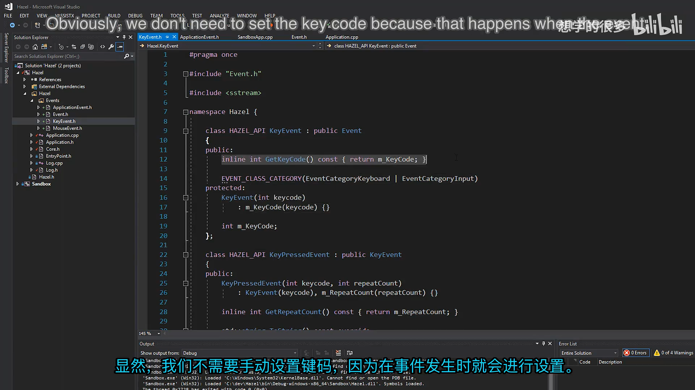

### 4.2 鼠标事件

`MouseMovedEvent` 保存当前鼠标的 `x`、`y` 坐标：

```cpp
class HAZEL_API MouseMovedEvent : public Event
{
public:
    MouseMovedEvent(float x, float y)
        : m_MouseX(x), m_MouseY(y) {}

    inline float GetX() const { return m_MouseX; }
    inline float GetY() const { return m_MouseY; }

    EVENT_CLASS_TYPE(MouseMoved)
    EVENT_CLASS_CATEGORY(EventCategoryMouse | EventCategoryInput)
private:
    float m_MouseX, m_MouseY;
};
```

滚轮事件同时保存水平和垂直偏移。部分鼠标或触控板具备横向滚动能力，因此不能只记录传统的 `yOffset`：

```cpp
class HAZEL_API MouseScrolledEvent : public Event
{
public:
    MouseScrolledEvent(float xOffset, float yOffset)
        : m_XOffset(xOffset), m_YOffset(yOffset) {}

    inline float GetXOffset() const { return m_XOffset; }
    inline float GetYOffset() const { return m_YOffset; }

    EVENT_CLASS_TYPE(MouseScrolled)
    EVENT_CLASS_CATEGORY(EventCategoryMouse | EventCategoryInput)
private:
    float m_XOffset, m_YOffset;
};
```

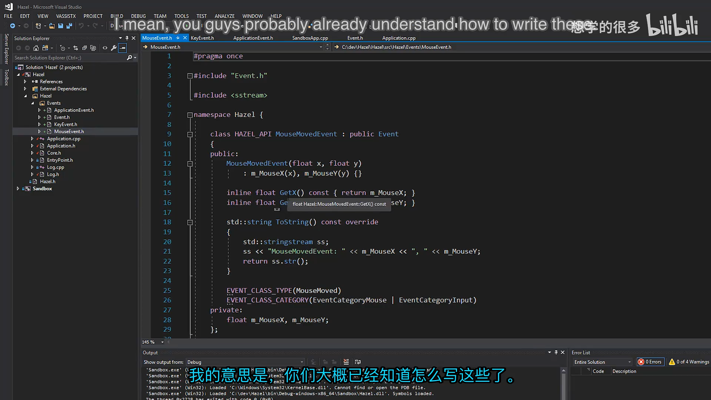

鼠标按钮也采用继承结构。`MouseButtonEvent` 保存按钮编号，按钮按下和释放事件共享这一部分：

```cpp
class HAZEL_API MouseButtonEvent : public Event
{
public:
    inline int GetMouseButton() const { return m_Button; }

    EVENT_CLASS_CATEGORY(EventCategoryMouse | EventCategoryInput)
protected:
    MouseButtonEvent(int button)
        : m_Button(button) {}

    int m_Button;
};
```

随后分别实现 `MouseButtonPressedEvent` 与 `MouseButtonReleasedEvent`。它们拥有自己的事件类型，并通过基类共享按钮数据。

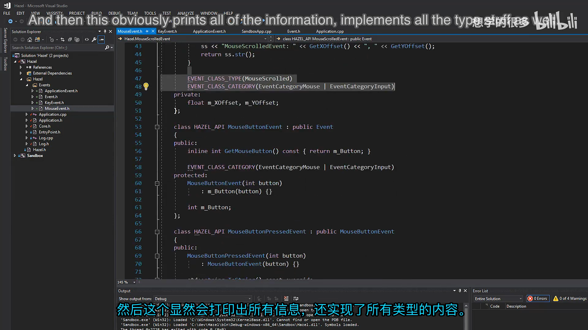

### 4.3 应用程序事件

`WindowCloseEvent` 不含额外数据，只表示窗口即将关闭：

```cpp
class HAZEL_API WindowCloseEvent : public Event
{
public:
    WindowCloseEvent() {}

    EVENT_CLASS_TYPE(WindowClose)
    EVENT_CLASS_CATEGORY(EventCategoryApplication)
};
```

`WindowResizeEvent` 则记录缩放后的宽高：

```cpp
class HAZEL_API WindowResizeEvent : public Event
{
public:
    WindowResizeEvent(unsigned int width, unsigned int height)
        : m_Width(width), m_Height(height) {}

    inline unsigned int GetWidth() const { return m_Width; }
    inline unsigned int GetHeight() const { return m_Height; }

    EVENT_CLASS_TYPE(WindowResize)
    EVENT_CLASS_CATEGORY(EventCategoryApplication)
private:
    unsigned int m_Width, m_Height;
};
```

同一文件中还定义了 `AppTickEvent`、`AppUpdateEvent` 和 `AppRenderEvent`。不过 Cherno 表示自己还没有完全决定是否要使用它们：这些调用是应用程序固有的主循环阶段，强行包装成事件未必比直接调用更合理。因此它们暂时保留为备选设计，而不是立即进入核心流程。

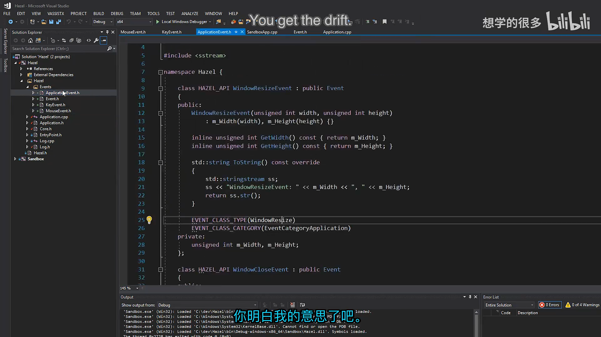

事件类的整体继承关系可以概括为：

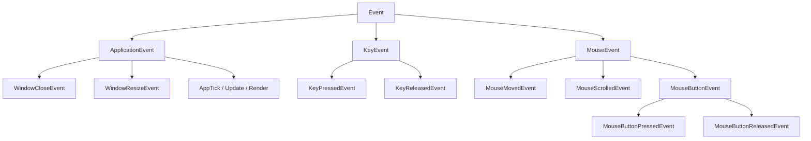

## 5. 用宏消除事件类的重复代码

每种具体事件都要提供三个看似固定、但实现细节略有不同的成员：

- 一个静态的 `GetStaticType()`；
- 一个虚函数 `GetEventType()`，返回对应的静态类型；
- 一个 `GetName()`，用于调试。

逐个手写既冗长又容易出错，因此使用 `EVENT_CLASS_TYPE` 宏统一生成：

```cpp
#define EVENT_CLASS_TYPE(type)                                              \
    static EventType GetStaticType() { return EventType::type; }            \
    virtual EventType GetEventType() const override                         \
    { return GetStaticType(); }                                             \
    virtual const char* GetName() const override { return #type; }
```

分类则通过另一个宏写入：

```cpp
#define EVENT_CLASS_CATEGORY(category)                                      \
    virtual int GetCategoryFlags() const override { return category; }
```

调用方只需要写：

```cpp
EVENT_CLASS_TYPE(KeyPressed)
EVENT_CLASS_CATEGORY(EventCategoryKeyboard | EventCategoryInput)
```

为什么同时需要静态的 `GetStaticType()` 和虚的 `GetEventType()`？

- 静态函数可以直接通过类型名调用，不需要先创建对象；
- 虚函数允许通过 `Event&` 或 `Event*` 查询多态对象的真实类型；
- 分发器正好利用前者判断模板类型，利用后者检查当前事件对象。

静态函数提供编译期已知的类型标识，虚函数再把这套标识暴露给运行时基类引用，两者一起构成分发器的类型判断基础。

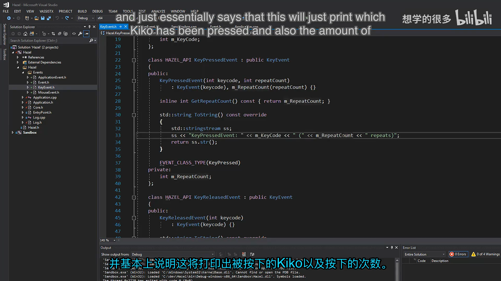

## 6. EventDispatcher：让分发代码保持简洁

事件系统最直接的用法是写出一连串判断：

```cpp
if (event.GetEventType() == EventType::WindowResize)
{
    auto& resizeEvent = static_cast<WindowResizeEvent&>(event);
    OnWindowResize(resizeEvent);
}
else if (event.GetEventType() == EventType::KeyPressed)
{
    auto& keyEvent = static_cast<KeyPressedEvent&>(event);
    OnKeyPressed(keyEvent);
}
```

这种调用端代码重复度高，而且类型判断和强制转换容易写错。`EventDispatcher` 把这一套模式封装起来：

```cpp
class EventDispatcher
{
    template<typename T>
    using EventFn = std::function<bool(T&)>;
public:
    EventDispatcher(Event& event)
        : m_Event(event)
    {
    }

    template<typename T>
    bool Dispatch(EventFn<T> func)
    {
        if (m_Event.GetEventType() == T::GetStaticType())
        {
            m_Event.m_Handled = func(*(T*)&m_Event);
            return true;
        }
        return false;
    }

private:
    Event& m_Event;
};
```

分发过程只有四步：

1. 比较当前事件的运行时类型和模板参数 `T` 的静态类型；
2. 若不一致，直接返回 `false`；
3. 若一致，把基类引用转换为具体事件类型并调用处理函数；
4. 用处理函数的返回值更新 `m_Handled`。

调用方可以连续注册多个处理分支：

```cpp
EventDispatcher dispatcher(e);
dispatcher.Dispatch<WindowResizeEvent>(
    [](WindowResizeEvent& event) {
        return OnWindowResize(event);
    });
```

处理函数返回 `true` 时，事件被标记为已处理，可用于阻止事件继续向其他层传播。尽管当前实现使用 `std::function` 和 C 风格指针转换，接口对客户端仍然足够直观，也把类型判断和具体类型转换集中在一个地方。

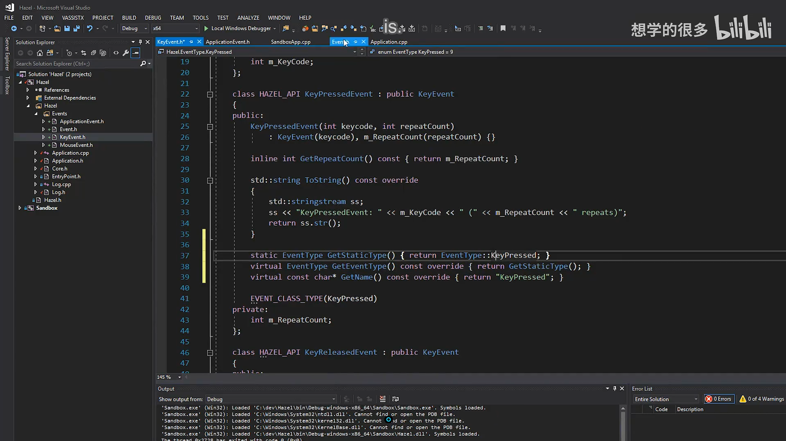

## 7. 与现有工程的集成

### 7.1 Premake 配置

本次工程配置修改集中在两个方面：

- 使用 Premake 的 `"latest"` 系统版本，避免硬编码 Windows SDK 版本；
- 将 Hazel 的 `src` 目录加入包含路径，使代码可以统一写 `Hazel/...`。

统一包含路径后，事件文件不需要计算“从当前目录回退几层”。即使文件以后移动到别的子目录，包含路径也不必逐个修改。

```lua
includedirs
{
    "%{prj.name}/src",
    "%{prj.name}/vendor/spdlog/include"
}
```

修改 Premake 文件后还需要重新生成 Visual Studio 工程，因此项目文件本身也会出现在差异中。

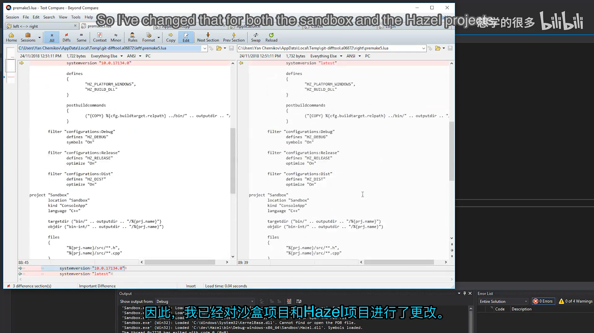

### 7.2 Core.h 增加位标志宏

`BIT(x)` 把数字 `1` 左移 `x` 位，为事件分类提供互不重叠的二进制位：

```cpp
#define BIT(x) (1 << x)
```

每个分类只占用一位，因此多个分类可以通过按位或组合，也可以低成本地做交集判断。

### 7.3 让日志系统支持 Event

为了让 `HZ_TRACE(e)` 这样的代码直接把事件传给 spdlog，`Log.h` 增加了 spdlog 的自定义类型输出支持：

```cpp
#include "spdlog/fmt/ostr.h"
```

`Event` 又提供了全局输出流运算符，因此日志系统可以自动调用 `ToString()`：

```cpp
inline std::ostream& operator<<(std::ostream& os, const Event& e)
{
    return os << e.ToString();
}
```

这表明字符串输出只承担调试职责，不进入事件系统的核心数据路径。

### 7.4 在 Application 中创建测试事件

为了验证事件创建、分类和日志链路，`Application::Run()` 先手工创建一个窗口缩放事件：

```cpp
WindowResizeEvent e(1280, 720);

if (e.IsInCategory(EventCategoryApplication))
{
    HZ_TRACE(e);
}

if (e.IsInCategory(EventCategoryInput))
{
    HZ_TRACE(e);
}
```

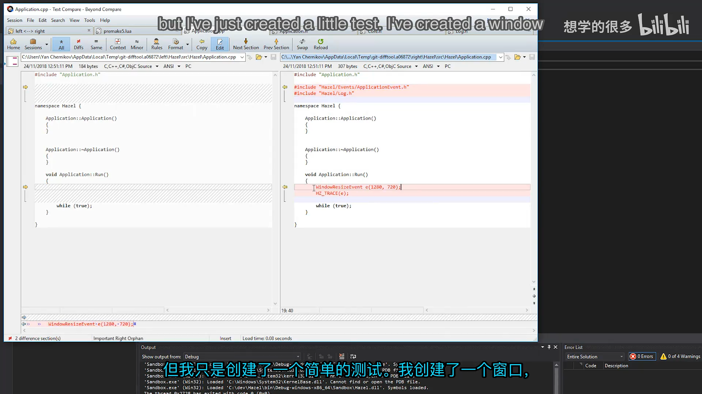

这个例子故意检查两个分类：

- 它属于 `Application`，所以第一次日志会被执行；
- 它不属于 `Input`，所以条件为假，不会重复输出；
- 如果两个条件都成立，同一个事件可能被记录两次，这正是分类过滤需要明确表达意图的原因。

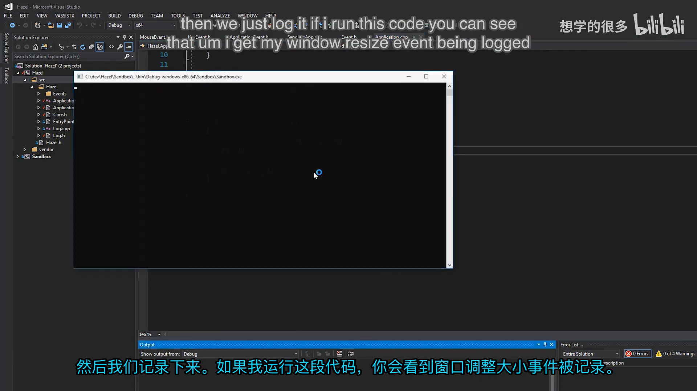

## 8. 当前限制与下一步

本节完成的是事件系统的第一阶段。它已经能描述事件、携带数据、判断分类、分发处理并阻止传播，但仍有三项明确边界。

第一，事件是阻塞且即时处理的。系统没有事件队列、缓冲或延迟分发，因此某一个处理函数耗费时间时，会直接影响产生事件时的调用链。

第二，当前系统只负责“通知发生了什么”，还不能回答“此刻某个输入是否持续按下”。输入状态需要额外保存按钮或按键的当前状态，Cherno 把这项工作规划给未来的 Input Manager。

第三，`AppTickEvent`、`AppUpdateEvent` 和 `AppRenderEvent` 仍是待定设计。它们与应用程序主循环紧密相关，也许直接调用更合适，因此暂时不会强行事件化。

下一步计划是先引入预编译头，减少公共标准库和第三方头文件带来的重复编译，再实现真正的窗口类。窗口接入后，本节创建的键盘、鼠标和窗口事件才会进入实际运行路径。

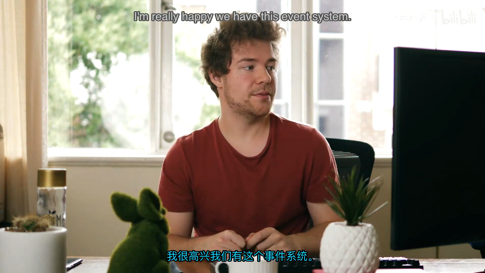

## 9. 本节结论

这一讲建立了一个足够小、但结构完整的事件系统骨架：

- 用 `EventType` 标识具体类型；
- 用位字段 `EventCategory` 表达多个正交分类；
- 用基类和继承共享键盘、鼠标、应用程序事件的公共数据；
- 用宏消除事件元数据样板；
- 用 `m_Handled` 控制事件消费和传播；
- 用 `EventDispatcher` 降低客户端的类型判断复杂度；
- 用日志输出运算符把自定义事件接入 spdlog。

最重要的设计原则不是“所有东西都必须变成事件”，而是根据模块边界和职责选择合适机制。事件适合通知状态变化和输入发生；主循环阶段和持续输入状态则可能需要更直接的调用或专门管理器。

## 附：官方参考

- [Bilibili 精译视频：009 - 事件系统](https://www.bilibili.com/video/BV1wtLazEEmC/?p=9)
- [The Cherno 游戏引擎系列播放列表](https://www.youtube.com/playlist?list=PLlrATfBNZ98dC-V-N3m0Go4deliWHPFwT5)
- [The Cherno 的 Hazel 仓库](https://github.com/TheCherno/Hazel)
- [本期对应代码提交 `34df416`](https://github.com/TheCherno/Hazel/tree/34df41651fe88041540f20df845a70642359dc17)
