# Hazel 游戏引擎笔记 011：窗口抽象与 GLFW

> 本节来源：[The Cherno 游戏引擎系列第 11 讲“窗口抽象与 GLFW”](https://www.bilibili.com/video/BV1wtLazEEmC/?p=11)，时长约 29 分 20 秒。  
> 原课程与 Hazel 代码作者：The Cherno。代码参考提交：[`6815f07`](https://github.com/TheCherno/Hazel/tree/6815f07cd23eb5cd55cfe6fccaec5aefdc8169e8)。  
> 本文由视频字幕重构、翻译并整理，不是官方教材；术语和代码以原视频及同期 Hazel 仓库为准。

## 本节目标

上一讲完成了预编译头，本节终于把窗口类接入 Hazel。不过窗口并不是直接写死在应用程序里，而是先建立平台无关的 `Window` 接口，再由 Windows 平台实现 `WindowsWindow`，底层通过 GLFW 创建原生窗口和 OpenGL 上下文。

本节完成后，引擎能够：

- 在运行时初始化 GLFW；
- 创建默认 `1280×720` 的窗口；
- 建立 OpenGL 上下文并清屏为洋红色；
- 由 `Application` 通过 `std::unique_ptr<Window>` 管理窗口生命周期；
- 在 `Window` 中预留事件回调接口，供下一讲把 GLFW 事件转发到应用程序。

**本讲不处理键盘、鼠标和窗口事件。** 事件回调接口只是为下一讲准备，当前窗口甚至还不能通过关闭按钮正确结束程序。

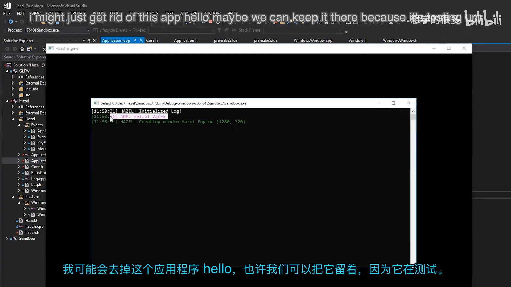

## 1. 为什么现在做窗口

*(参考时间: 00:00:08)*

严格从工程顺序看，游戏引擎可以在很晚才创建窗口。日志系统、事件系统、应用系统、层系统和输入管理等基础模块，都可能在窗口之前完成。但本系列同时承担教学与内容节奏，如果一直不显示任何图形，观众很难直观看到进展。

Cherno 因此做出折中：先完成日志和事件等必要基础，再开始创建窗口。日志用于观察窗口初始化是否成功，事件系统则与窗口输入紧密相关。窗口实现完成后，下一步才有稳定的 OpenGL 上下文来绘制画面和接入 ImGui。

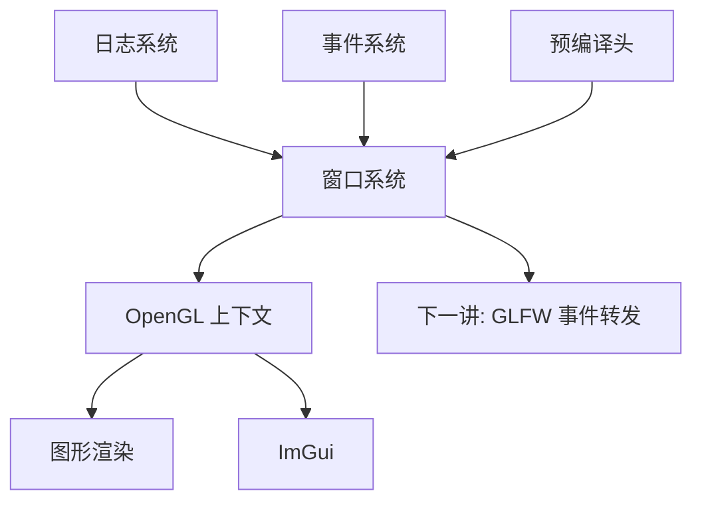

## 2. 平台抽象应该放在哪里

*(参考时间: 00:04:48)*

GLFW 本身已经跨平台，能够在 Windows、macOS 和 Linux 上创建窗口，并提供 OpenGL 上下文。即便如此，Hazel 仍然选择“每个平台一个窗口实现”，而不是把 GLFW 调用直接写进通用应用代码。

原因是未来不同平台仍可能出现差异：

- Windows 后续若改用 Win32 和 DirectX，需要直接获得 `HWND`、设备上下文等原生句柄；
- macOS 和 Linux 可能有各自特有的窗口行为；
- 移动平台通常没有传统桌面窗口，而是使用 surface；
- 渲染后端还可能扩展为 OpenGL、DirectX、Vulkan 和 Metal。

因此，平台抽象被分成两层：

1. `Hazel/Window.h` 定义与平台无关的窗口接口；
2. `Hazel/src/Platform/Windows/WindowsWindow.*` 实现 Windows 版本。

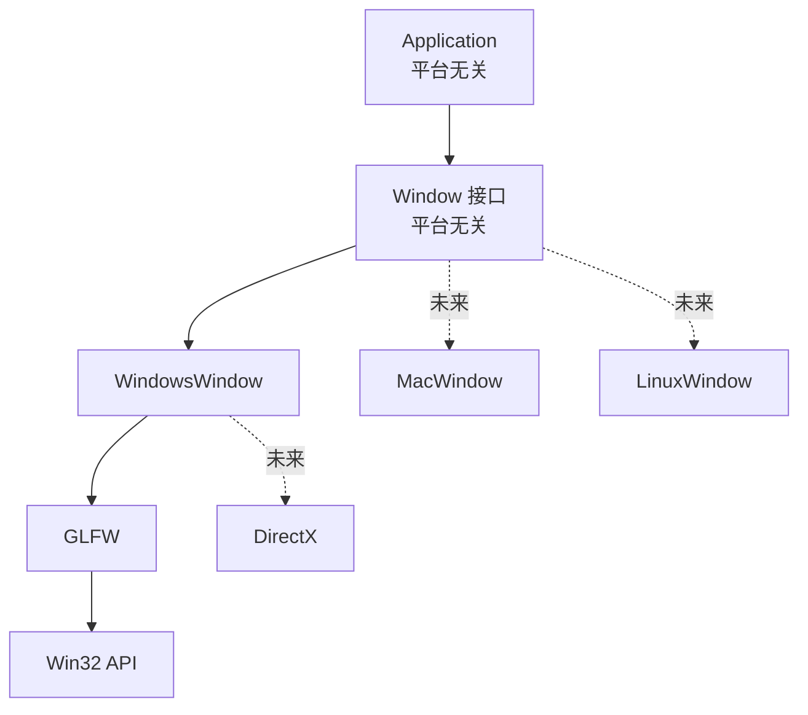

`Platform` 目录未来不仅放操作系统代码，也会放渲染 API 代码。这样通用代码只依赖抽象接口，平台细节集中在明确目录中。

## 3. 用 Git 子模块引入 GLFW

*(参考时间: 00:08:21)*

Cherno 使用了自己维护的 GLFW 分支，并为其补充 Premake 构建脚本。GLFW 不会以预编译二进制方式直接塞进仓库，而是作为 Git 子模块放置到：

```text
Hazel/vendor/GLFW
```

命令形式上相当于：

```bash
git submodule add https://github.com/TheCherno/glfw Hazel/vendor/GLFW
```

使用子模块的好处是源码和构建脚本都在解决方案中，可以统一编译、调试和升级。缺点是依赖本身维护在独立仓库，主仓库只记录它指向的具体提交。

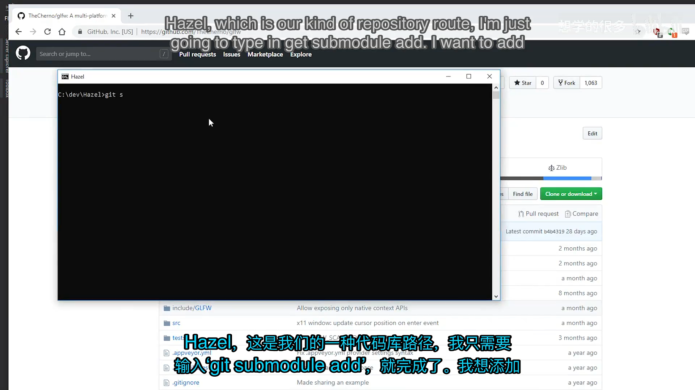

## 4. 把 GLFW 接入 Premake

*(参考时间: 00:09:53)*

主 Premake 文件增加三项关键配置：

1. 建立依赖包含目录表；
2. 引入 GLFW 自己的 Premake 文件；
3. 让 Hazel 链接 GLFW 和 `opengl32.lib`。

```lua
IncludeDir = {}
IncludeDir["GLFW"] = "Hazel/vendor/GLFW/include"

include "Hazel/vendor/GLFW"

includedirs
{
    "%{prj.name}/src",
    "%{prj.name}/vendor/spdlog/include",
    "%{IncludeDir.GLFW}"
}

links
{
    "GLFW",
    "opengl32.lib"
}
```

`include "Hazel/vendor/GLFW"` 会把 GLFW 提供的 Premake 文件展开到当前构建脚本中，从而生成一个名为 GLFW 的静态库项目。Hazel 随后把它作为项目依赖链接进去。

视频中还顺带处理了 Lua 文件里 Tab 与空格混用造成的缩进问题。格式本身不改变编译结果，但会让差异和后续维护变得混乱，因此需要统一缩进规则。

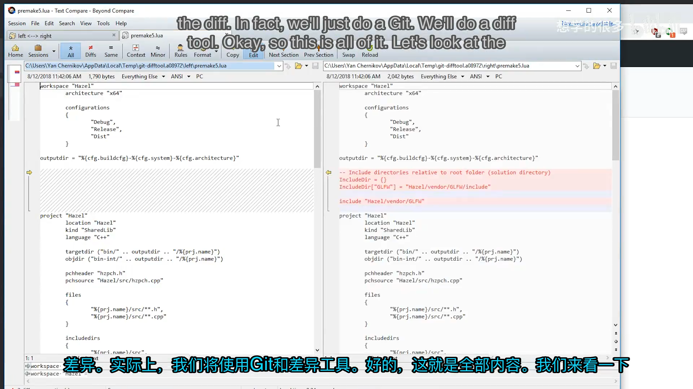

运行 `GenerateProjects.bat` 后，Visual Studio 解决方案中会出现 GLFW 项目，Hazel 项目也会显示对 GLFW 的引用。第一次编译时虽然出现了 Visual Studio 不认识的命令行选项，但构建仍成功，说明 GLFW 已经作为静态库接入了工程。

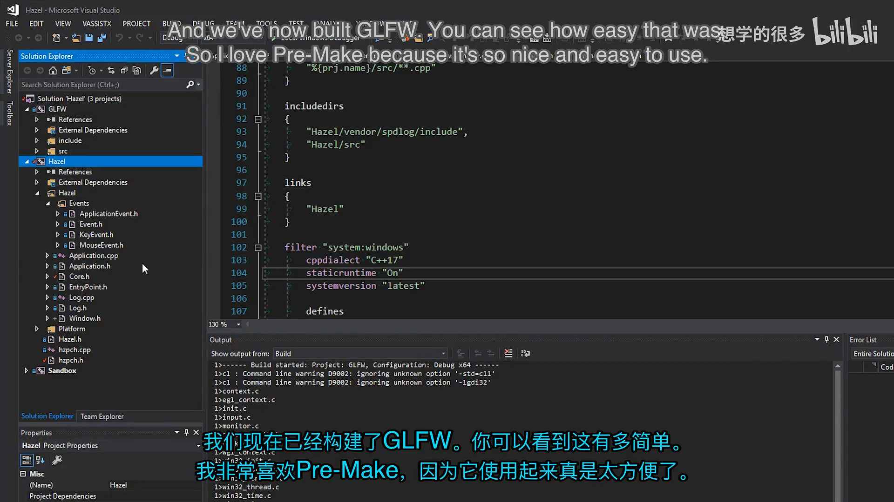

## 5. Window 接口与窗口属性

*(参考时间: 00:15:09)*

平台无关的窗口接口位于 `Hazel/Window.h`。它几乎没有状态，只有一组纯虚函数，相当于桌面窗口的抽象契约。

```cpp
struct WindowProps
{
    std::string Title;
    unsigned int Width;
    unsigned int Height;

    WindowProps(const std::string& title = "Hazel Engine",
                unsigned int width = 1280,
                unsigned int height = 720)
        : Title(title), Width(width), Height(height)
    {
    }
};

class HAZEL_API Window
{
public:
    using EventCallbackFn = std::function<void(Event&)>;

    virtual ~Window() {}

    virtual void OnUpdate() = 0;
    virtual unsigned int GetWidth() const = 0;
    virtual unsigned int GetHeight() const = 0;

    virtual void SetEventCallback(const EventCallbackFn& callback) = 0;
    virtual void SetVSync(bool enabled) = 0;
    virtual bool IsVSync() const = 0;

    static Window* Create(const WindowProps& props = WindowProps());
};
```

这里有几个重要设计点：

- `WindowProps` 把标题和尺寸集中为配置对象，并提供 `Hazel Engine`、`1280×720` 默认值；
- `EventCallbackFn` 允许应用注册一个接收 `Event&` 的回调；
- `OnUpdate()` 每帧调用一次，负责平台窗口的消息与缓冲区交换；
- `SetVSync()` 和 `IsVSync()` 暴露垂直同步控制；
- `Create()` 是静态工厂，但实现放在平台文件中，因此会返回对应平台的窗口子类。

接口中完全不包含 GLFW 类型。应用代码因此不需要包含 `glfw3.h`，也不会和具体平台实现耦合。

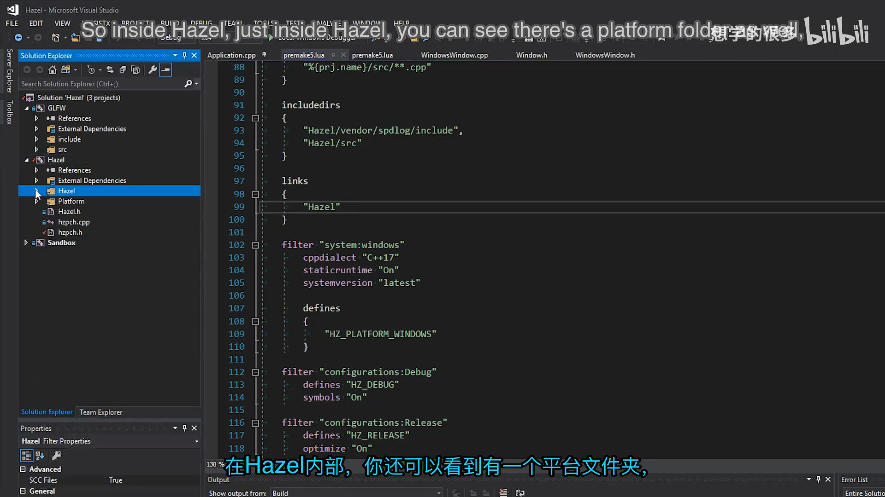

### 5.1 为什么没有 Window.cpp

`Window` 本身只是接口，不应包含平台创建逻辑。`Create()` 的声明可以放在通用头文件，但实现必须由当前平台的 `.cpp` 提供。

Windows 构建时，`Window::Create()` 返回 `WindowsWindow`；未来 macOS 构建时，同一函数可以返回 `MacWindow`。选择哪个实现发生在编译期，不需要在运行时写 `switch` 判断平台。

## 6. WindowsWindow 的数据布局

*(参考时间: 00:17:20)*

Windows 实现位于 `Platform/Windows/WindowsWindow.h`。它继承 `Window`，保存一个原生 GLFW 窗口指针，并把通用窗口数据组织到 `WindowData` 中。

```cpp
class WindowsWindow : public Window
{
public:
    WindowsWindow(const WindowProps& props);
    virtual ~WindowsWindow();

    void OnUpdate() override;

    inline unsigned int GetWidth() const override { return m_Data.Width; }
    inline unsigned int GetHeight() const override { return m_Data.Height; }

    inline void SetEventCallback(const EventCallbackFn& callback) override
    {
        m_Data.EventCallback = callback;
    }

    void SetVSync(bool enabled) override;
    bool IsVSync() const override;

private:
    virtual void Init(const WindowProps& props);
    virtual void Shutdown();

    GLFWwindow* m_Window;

    struct WindowData
    {
        std::string Title;
        unsigned int Width, Height;
        bool VSync;
        EventCallbackFn EventCallback;
    };

    WindowData m_Data;
};
```

为什么需要单独的 `WindowData`？GLFW 的事件回调是普通函数指针，不能直接绑定 C++ 成员函数和当前对象。GLFW 提供“window user pointer”，允许每个窗口携带一段自定义数据。

Hazel 选择把 `WindowData` 的地址交给 GLFW。回调发生时，可以从原生窗口取回同一个结构，读取或更新宽高、VSync 和事件回调，而不需要把整个 `WindowsWindow` 类型暴露给 GLFW。

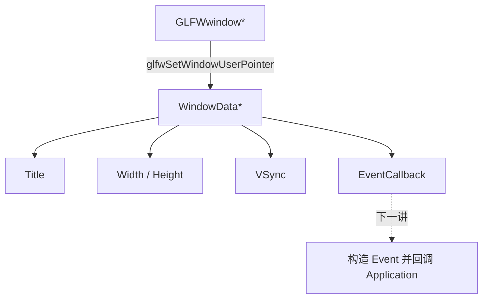

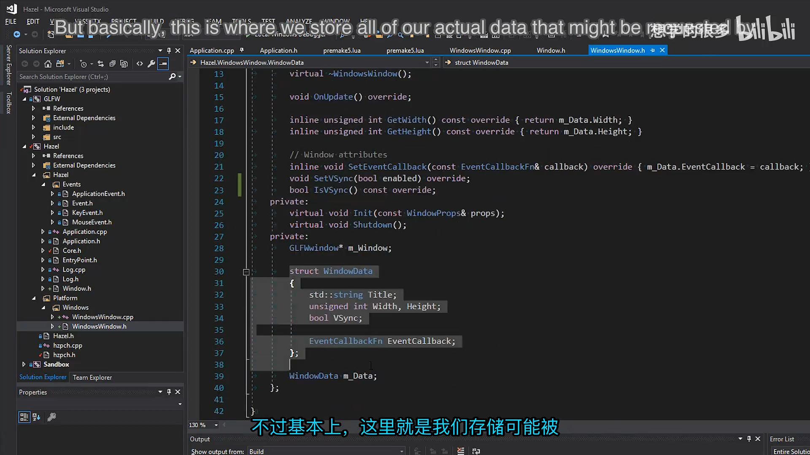

## 7. 工厂函数与 GLFW 单次初始化

*(参考时间: 00:18:46)*

`Window::Create()` 的实现只有一行：

```cpp
Window* Window::Create(const WindowProps& props)
{
    return new WindowsWindow(props);
}
```

它返回基类指针，调用方不需要知道具体类型。`Application` 之后会用 `std::unique_ptr<Window>` 接管这个对象。

### 7.1 静态初始化标记

GLFW 在进程中只应初始化一次，但同一个程序未来可能创建多个窗口。因此 Windows 实现使用静态布尔值记录全局初始化状态：

```cpp
static bool s_GLFWInitialized = false;
```

初始化逻辑如下：

```cpp
if (!s_GLFWInitialized)
{
    int success = glfwInit();
    HZ_CORE_ASSERT(success, "Could not intialize GLFW!");
    s_GLFWInitialized = true;
}
```

这里特意把 `glfwInit()` 的返回值保存到局部变量，再交给断言检查。原因是断言在发布构建中可能被完全移除；如果把初始化函数直接写在断言表达式里，发布版就不会执行 `glfwInit()`。

如果未来需要断言始终保留表达式副作用，可以引入 `VERIFY` 宏。它与断言相似，但即使断言输出被关闭，仍然会执行被检查的表达式。

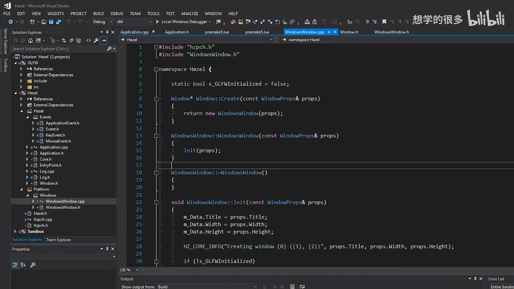

## 8. 断言系统

*(参考时间: 00:20:17)*

`Core.h` 新增了客户端断言和核心断言：

```cpp
#ifdef HZ_ENABLE_ASSERTS
    #define HZ_ASSERT(x, ...) { \
        if (!(x)) { \
            HZ_ERROR("Assertion Failed: {0}", __VA_ARGS__); \
            __debugbreak(); \
        } \
    }

    #define HZ_CORE_ASSERT(x, ...) { \
        if (!(x)) { \
            HZ_CORE_ERROR("Assertion Failed: {0}", __VA_ARGS__); \
            __debugbreak(); \
        } \
    }
#else
    #define HZ_ASSERT(x, ...)
    #define HZ_CORE_ASSERT(x, ...)
#endif
```

启用断言时，条件失败会记录错误并触发调试器断点；关闭断言后，宏展开为空，不产生发布版开销。当前 `__debugbreak()` 是 Windows 专用实现，未来支持其他平台时需要切换为平台对应机制。

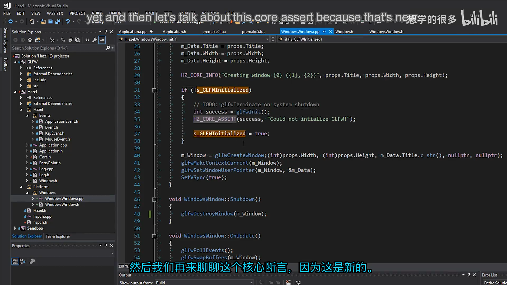

## 9. 创建 GLFW 窗口与 OpenGL 上下文

*(参考时间: 00:22:00)*

`WindowsWindow::Init()` 完成以下步骤：

1. 把 `WindowProps` 复制到 `m_Data`；
2. 记录窗口创建日志；
3. 在必要时初始化 GLFW；
4. 调用 `glfwCreateWindow()`；
5. 将 OpenGL 上下文设为当前上下文；
6. 将 `m_Data` 注册为窗口用户指针；
7. 默认开启 VSync。

关键代码如下：

```cpp
m_Data.Title = props.Title;
m_Data.Width = props.Width;
m_Data.Height = props.Height;

HZ_CORE_INFO("Creating window {0} ({1}, {2})",
             props.Title, props.Width, props.Height);

m_Window = glfwCreateWindow(
    (int)props.Width,
    (int)props.Height,
    m_Data.Title.c_str(),
    nullptr,
    nullptr);

glfwMakeContextCurrent(m_Window);
glfwSetWindowUserPointer(m_Window, &m_Data);
SetVSync(true);
```

`glfwCreateWindow()` 的前两个参数是逻辑宽高，第三个参数是窗口标题。两个 `nullptr` 分别表示使用默认显示器和与当前 GLFW 上下文共享资源的窗口。当前版本直接从 GLFW 获得 OpenGL 上下文，尚未配置 OpenGL 版本、Core Profile 或显式加载函数。

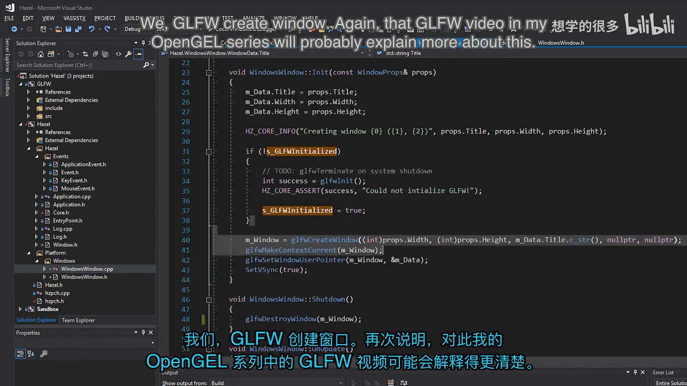

## 10. VSync、更新与关闭

*(参考时间: 00:23:04)*

### 10.1 VSync

```cpp
void WindowsWindow::SetVSync(bool enabled)
{
    if (enabled)
        glfwSwapInterval(1);
    else
        glfwSwapInterval(0);

    m_Data.VSync = enabled;
}
```

交换间隔为 `1` 时，缓冲区交换通常等待一个垂直刷新周期，从而把帧率限制在显示器刷新率附近；设置为 `0` 则不等待。这里的 `1` 表示间隔数量，不应理解成“只允许渲染一帧”。

GLFW 不提供查询当前交换间隔的简单接口，因此 Hazel 在 `WindowData` 中自行保存 `VSync` 状态，由 `IsVSync()` 返回。

### 10.2 每帧更新

```cpp
void WindowsWindow::OnUpdate()
{
    glfwPollEvents();
    glfwSwapBuffers(m_Window);
}
```

`glfwPollEvents()` 处理操作系统和 GLFW 收集到的事件；`glfwSwapBuffers()` 提交当前 OpenGL 帧。考虑到本讲尚未注册事件回调，这里已经把所有输入事件从系统队列中取走，却还没有转交给 Hazel。

### 10.3 关闭

析构函数调用 `Shutdown()`：

```cpp
void WindowsWindow::Shutdown()
{
    glfwDestroyWindow(m_Window);
}
```

这里只销毁当前原生窗口，而不调用 `glfwTerminate()`。因为进程可能创建多个窗口，并且 GLFW 只初始化一次，全局终止应当在更明确的系统关闭阶段处理。当前代码仍保留了将来补充 `glfwTerminate()` 的 TODO。

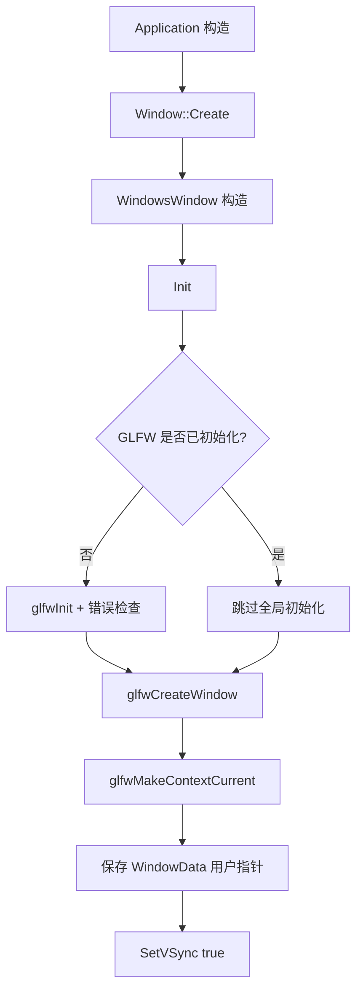

## 11. 把窗口接入 Application

*(参考时间: 00:23:53)*

`Application` 是平台无关层，因此只保存 `Window` 基类指针：

```cpp
class HAZEL_API Application
{
public:
    Application();
    virtual ~Application();

    void Run();

private:
    std::unique_ptr<Window> m_Window;
    bool m_Running = true;
};
```

构造函数中通过工厂创建窗口：

```cpp
Application::Application()
{
    m_Window = std::unique_ptr<Window>(Window::Create());
}
```

`std::unique_ptr` 明确表达所有权：`Application` 拥有窗口，并在自身销毁时自动释放。构造顺序也很清晰：

```text
Application 构造
  -> Window::Create()
  -> new WindowsWindow()
  -> WindowsWindow::Init()
  -> GLFW 初始化与窗口创建
```

原来的事件测试代码被移除，主循环暂时简化为：

```cpp
void Application::Run()
{
    while (m_Running)
    {
        glClearColor(1, 0, 1, 1);
        glClear(GL_COLOR_BUFFER_BIT);
        m_Window->OnUpdate();
    }
}
```

`glClearColor(1, 0, 1, 1)` 分别表示红色、绿色、蓝色和 alpha，结果为不透明洋红色。它暂时验证 OpenGL 上下文有效，并让窗口中的清屏结果肉眼可见。

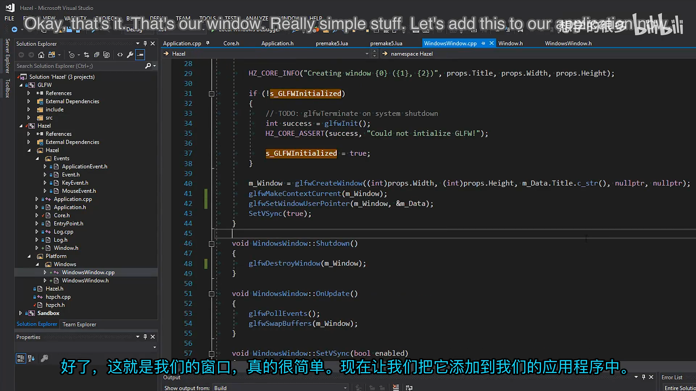

## 12. 第一次运行结果

*(参考时间: 00:25:42)*

运行程序后，输出窗口记录了：

```text
Creating window Hazel Engine (1280, 720)
```

屏幕上出现标题为 `Hazel Engine`、大小为 `1280×720` 的窗口，内部显示洋红色清屏颜色。这说明：

- Premake 正确生成并链接了 GLFW；
- GLFW 成功初始化；
- 原生窗口创建成功；
- OpenGL 上下文有效；
- 每帧清屏和缓冲区交换正常工作。

暂时还不能通过点击关闭按钮结束应用，因为关闭事件尚未转换成 Hazel 的 `WindowCloseEvent`，主循环中的 `m_Running` 也还没有被修改。这正是下一讲需要补上的内容。

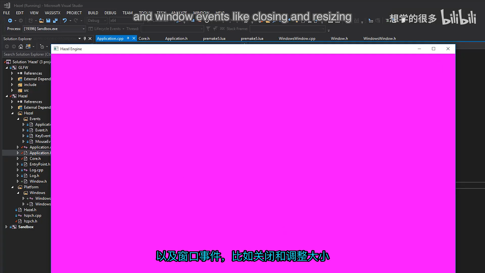

## 13. 为下一讲预留事件回调

*(参考时间: 00:27:05)*

`Window` 已经定义了：

```cpp
using EventCallbackFn = std::function<void(Event&)>;
virtual void SetEventCallback(const EventCallbackFn& callback) = 0;
```

`WindowsWindow` 会将这个回调保存在 `WindowData.EventCallback`。下一讲可以注册 GLFW 的窗口大小、关闭、键盘、鼠标按钮、滚轮和鼠标移动回调，在这些原生回调中：

1. 通过 `glfwGetWindowUserPointer()` 找回 `WindowData`；
2. 根据 GLFW 参数构造 Hazel 的 `Event` 子类；
3. 调用 `data.EventCallback(event)`；
4. 由 `Application::OnEvent()` 使用 `EventDispatcher` 分发给各层。

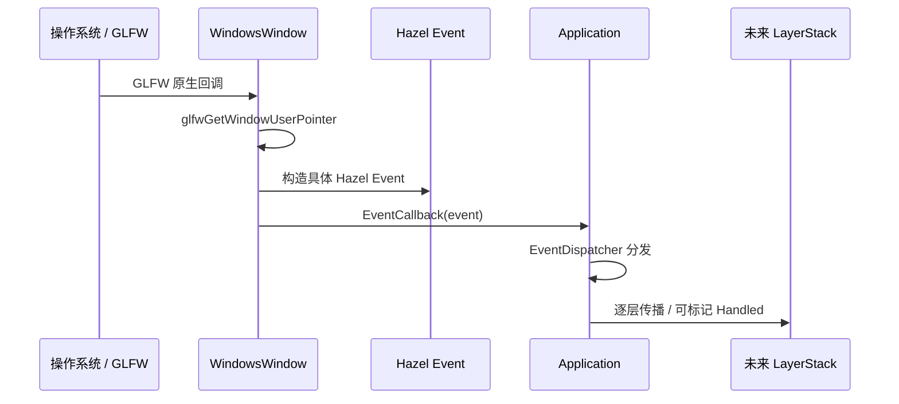

视频明确说明，窗口类不应直接依赖 `Application`。它只依赖 `Window` 的抽象回调类型，由应用主动注册回调，从而保持模块解耦。

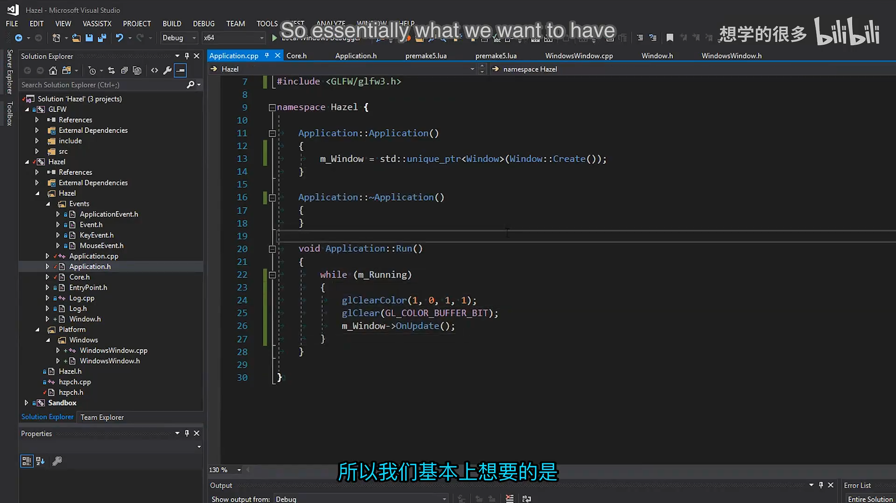

## 14. 其他工程调整

*(参考时间: 00:27:50)*

日志几乎每个文件都会使用，因此本讲把日志头加入预编译头，减少重复解析和编译开销。

```cpp
// hzpch.h
#include "Hazel/Log.h"
```

另外，应用不再需要上一讲用于测试事件系统的手工 `WindowResizeEvent` 代码。事件系统本身保留，只是本讲的主循环重点转移到窗口创建和 OpenGL 清屏。

## 15. 本节结论

本讲完成了一个清晰的最小窗口层：

- 用 Git 子模块引入 GLFW；
- 用 Premake 将 GLFW 作为静态库项目编译并链接；
- 定义平台无关的 `Window` 接口与 `WindowProps`；
- 在 `WindowsWindow` 中封装 GLFW 和原生窗口指针；
- 用 `WindowData` 为未来 GLFW 事件回调准备用户数据；
- 通过工厂函数隐藏平台实现；
- 使用断言检查 GLFW 初始化；
- 创建 OpenGL 上下文，支持 VSync；
- 在 `Application` 中拥有窗口并驱动每帧更新；
- 用洋红色清屏验证图形上下文成功工作。

这一讲最重要的不是“窗口出现”本身，而是建立了平台抽象的边界。应用只依赖 `Window`，Windows 细节留在 `WindowsWindow` 和 `Platform/Windows` 中。事件回调接口也已经就位于窗口边界，下一讲只需把 GLFW 的原生事件转换为 Hazel 事件。

## 附：官方参考

- [Bilibili 精译视频：011 - 窗口抽象与 GLFW](https://www.bilibili.com/video/BV1wtLazEEmC/?p=11)
- [The Cherno 游戏引擎系列播放列表](https://www.youtube.com/playlist?list=PLlrATfBNZ98dC-V-N3m0Go4deliWHPFwT5)
- [The Cherno 的 Hazel 仓库](https://github.com/TheCherno/Hazel)
- [本期对应代码提交 `6815f07`](https://github.com/TheCherno/Hazel/tree/6815f07cd23eb5cd55cfe6fccaec5aefdc8169e8)
- [Cherno 的 GLFW 分支](https://github.com/TheCherno/glfw)
