# Hazel 游戏引擎笔记 012：窗口事件

> 本节来源：[The Cherno 游戏引擎系列第 12 讲“窗口事件”](https://www.bilibili.com/video/BV1wtLazEEmC/?p=12)，时长约 23 分 37 秒。  
> 原课程与 Hazel 代码作者：The Cherno。代码参考提交：[`30516ad`](https://github.com/TheCherno/Hazel/tree/30516ad7109b016213eb732f14e1c7061c1db603)。  
> 本文由视频字幕重构、翻译并整理，不是官方教材；术语和代码以原视频及同期 Hazel 仓库为准。

## 本节目标

上一讲创建了抽象窗口和 `WindowsWindow`，但窗口事件只会被 `glfwPollEvents()` 从系统队列取走，无法进入 Hazel。本讲把“事件系统”和“窗口系统”连接起来：

- `Application` 向窗口注册 `OnEvent` 回调；
- `WindowsWindow` 注册 GLFW 的窗口大小、关闭、键盘、鼠标按钮、滚轮和鼠标移动回调；
- 每个原生回调都转换成对应的 Hazel `Event`；
- `Application` 使用 `EventDispatcher` 判断事件类型；
- 收到 `WindowCloseEvent` 后把 `m_Running` 设为 `false`，真正关闭应用。

完成本节后，点击窗口关闭按钮不再“无响应”，而是通过 Hazel 自己的事件系统结束主循环。

## 1. 事件系统与窗口系统如何连接

*(参考时间: 00:00:28)*

窗口会不断产生事件：

- 鼠标移动；
- 键盘按下、释放和重复；
- 鼠标按钮按下与释放；
- 鼠标滚轮；
- 窗口缩放；
- 窗口关闭。

事件系统知道怎样描述和分发事件，窗口知道什么时候发生事件，但两者此前没有连接。本节需要完成一次转换：

```text
操作系统 / GLFW 原生事件
  -> WindowsWindow 原生回调
  -> 构造 Hazel Event
  -> 调用 WindowData.EventCallback
  -> Application::OnEvent
  -> EventDispatcher
  -> 具体处理函数
```

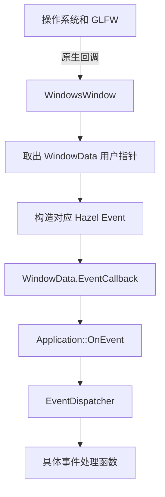

最急迫的实际问题是关闭按钮。当前点击关闭按钮没有任何效果，因为关闭事件没有被转换成 `WindowCloseEvent`，主循环中的 `m_Running` 也没有被修改。

## 2. Application 注册事件回调

*(参考时间: 00:02:12)*

`Window` 接口上一讲已经预留：

```cpp
using EventCallbackFn = std::function<void(Event&)>;
virtual void SetEventCallback(const EventCallbackFn& callback) = 0;
```

`Application` 构造函数现在把这个回调注册到窗口：

```cpp
Application::Application()
{
    m_Window = std::unique_ptr<Window>(Window::Create());
    m_Window->SetEventCallback(BIND_EVENT_FN(OnEvent));
}
```

窗口不需要知道 `Application` 类型，只保存一个接受 `Event&` 的通用回调。这样窗口层继续保持独立，应用层也不需要直接接触 GLFW。

`Application` 头文件增加事件入口和关闭处理声明：

```cpp
void OnEvent(Event& e);

private:
    bool OnWindowClose(WindowCloseEvent& e);
```


## 3. 用宏简化成员函数绑定

*(参考时间: 00:03:37)*

`SetEventCallback` 需要的是一个普通函数对象，而 `OnEvent` 是 `Application` 的成员函数。代码使用 `std::bind` 绑定当前实例：

```cpp
#define BIND_EVENT_FN(x) \
    std::bind(&Application::x, this, std::placeholders::_1)
```

之后可以写成：

```cpp
BIND_EVENT_FN(OnEvent)
```

它等价于：

```cpp
std::bind(&Application::OnEvent,
          this,
          std::placeholders::_1)
```

没有宏时，每个事件处理函数都要重复写类名、`this` 和占位符。宏把这套固定形式集中起来，让分发代码更短。

还可以把宏进一步泛化，使其不写死 `Application`：

```cpp
#define BIND_EVENT_FN(x) \
    std::bind(&x, this, std::placeholders::_1)

// 使用时：
BIND_EVENT_FN(Application::OnEvent)
```

视频保留了当前更简单的版本，因为它只服务于 `Application` 的事件处理。

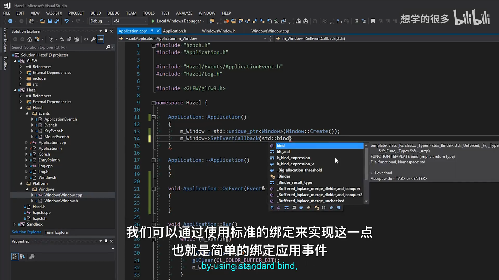

## 4. OnEvent 与事件日志

*(参考时间: 00:04:33)*

`Application::OnEvent` 成为窗口事件的统一入口：

```cpp
void Application::OnEvent(Event& e)
{
    EventDispatcher dispatcher(e);
    dispatcher.Dispatch<WindowCloseEvent>(
        BIND_EVENT_FN(OnWindowClose));

    HZ_CORE_TRACE("{0}", e);
}
```

窗口回调会把事件保存到 `WindowData.EventCallback`。因此 `data.EventCallback(event)` 最终会进入 `Application::OnEvent`。

日志使用 `HZ_CORE_TRACE` 而不是 `HZ_CORE_INFO`，避免调试事件持续以高亮颜色刷满控制台。由于每种事件都实现了 `ToString()`，日志可以直接看到事件类型和携带的数据。

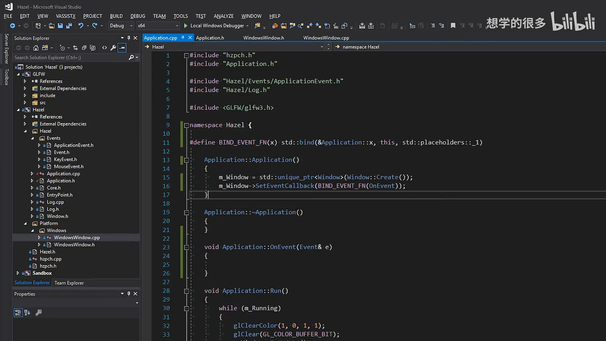

## 5. 从 GLFW 回调找回 WindowData

*(参考时间: 00:06:20)*

GLFW 原生回调只能收到 `GLFWwindow*`，不能直接拿到 `WindowsWindow` 对象。上一讲通过 `glfwSetWindowUserPointer()` 保存了 `WindowData` 地址：

```cpp
glfwSetWindowUserPointer(m_Window, &m_Data);
```

在任意 GLFW 回调中，可以取回这个 `void*`：

```cpp
WindowData& data =
    *(WindowData*)glfwGetWindowUserPointer(window);
```

这是一种 C 风格强制转换。它要求注册用户指针时和回调读取时使用完全相同的类型。所有 GLFW 回调随后都复用这条路径，再调用：

```cpp
data.EventCallback(event);
```

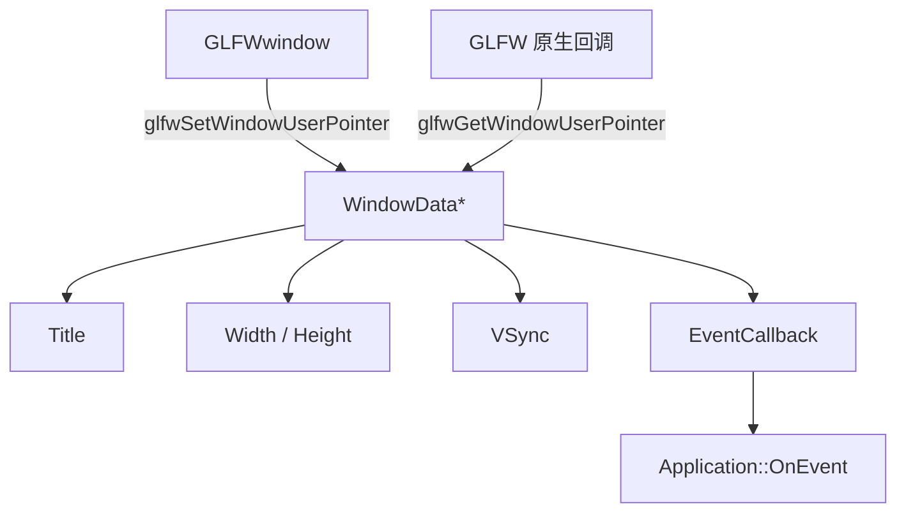

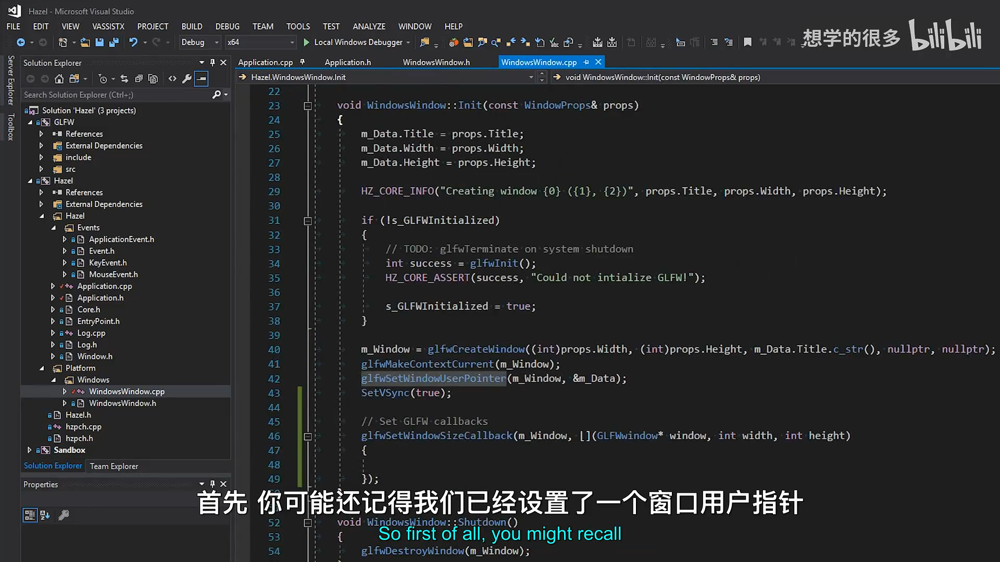

## 6. GLFW 事件回调逐项实现

*(参考时间: 00:05:16)*

所有原生回调都在 `WindowsWindow::Init()` 中注册。

### 6.1 窗口大小变化

```cpp
glfwSetWindowSizeCallback(m_Window,
    [](GLFWwindow* window, int width, int height)
    {
        WindowData& data =
            *(WindowData*)glfwGetWindowUserPointer(window);

        data.Width = width;
        data.Height = height;

        WindowResizeEvent event(width, height);
        data.EventCallback(event);
    });
```

这里先更新 `WindowData`，再创建和分发事件。原因是事件处理函数可能会查询窗口当前宽高；如果等到回调结束后才更新缓存，处理函数读到的仍是旧尺寸。

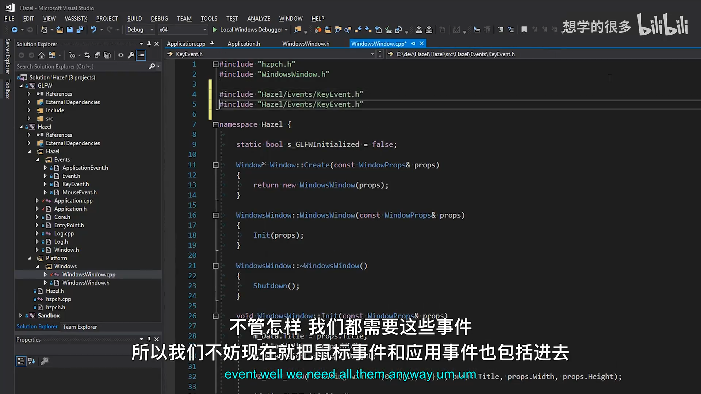

### 6.2 窗口关闭

关闭回调没有额外参数，只需要构造 `WindowCloseEvent`：

```cpp
glfwSetWindowCloseCallback(m_Window,
    [](GLFWwindow* window)
    {
        WindowData& data =
            *(WindowData*)glfwGetWindowUserPointer(window);

        WindowCloseEvent event;
        data.EventCallback(event);
    });
```

### 6.3 键盘回调

GLFW 键盘回调包含：

- `key`：GLFW 键码；
- `scancode`：平台扫描码；
- `action`：`GLFW_PRESS`、`GLFW_RELEASE` 或 `GLFW_REPEAT`；
- `mods`：Shift、Ctrl、Alt 等修饰键状态。

代码对 `action` 进行分支：

```cpp
switch (action)
{
    case GLFW_PRESS:
    {
        KeyPressedEvent event(key, 0);
        data.EventCallback(event);
        break;
    }
    case GLFW_RELEASE:
    {
        KeyReleasedEvent event(key);
        data.EventCallback(event);
        break;
    }
    case GLFW_REPEAT:
    {
        KeyPressedEvent event(key, 1);
        data.EventCallback(event);
        break;
    }
}
```

首次按下使用 `repeatCount = 0`，系统重复事件暂时统一使用 `repeatCount = 1`。GLFW 没有通过这个回调提供具体重复次数，而 Win32 API 可以；如果未来需要精确计数，需要从平台层补充。

视频也指出一个重要边界：当前直接把 GLFW 键码塞进 `KeyPressedEvent`，而 Hazel 最终需要自己的键码枚举。否则其他平台或非 GLFW 后端会暴露后端特定值。目前先把事件通路跑通，键码转换留到后续输入系统。

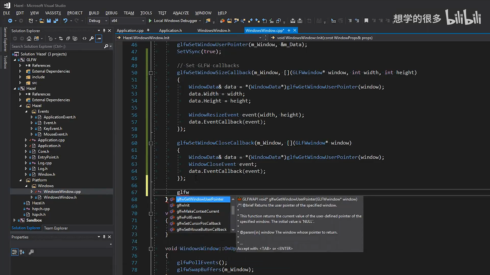

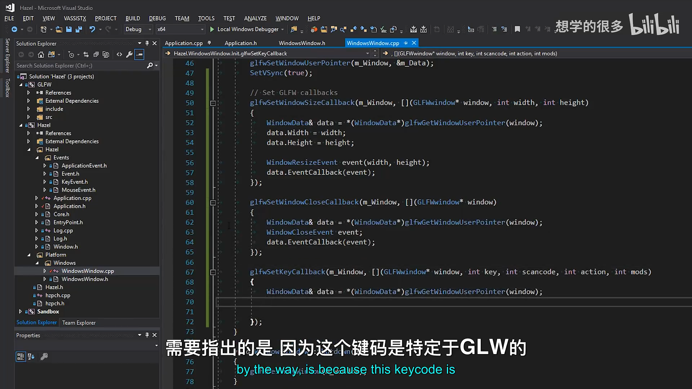

### 6.4 鼠标按钮

鼠标按钮回调与键盘类似，但只有按下和释放：

```cpp
switch (action)
{
    case GLFW_PRESS:
    {
        MouseButtonPressedEvent event(button);
        data.EventCallback(event);
        break;
    }
    case GLFW_RELEASE:
    {
        MouseButtonReleasedEvent event(button);
        data.EventCallback(event);
        break;
    }
}
```

当前没有鼠标按钮重复事件。

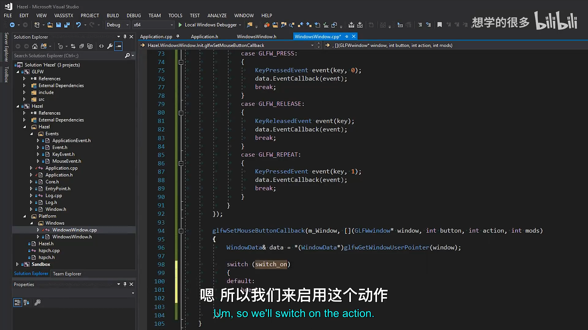

### 6.5 鼠标滚轮

GLFW 滚轮回调提供两个 `double` 偏移：

```cpp
glfwSetScrollCallback(m_Window,
    [](GLFWwindow* window, double xOffset, double yOffset)
    {
        WindowData& data =
            *(WindowData*)glfwGetWindowUserPointer(window);

        MouseScrolledEvent event(
            (float)xOffset,
            (float)yOffset);
        data.EventCallback(event);
    });
```

Hazel 的 `MouseScrolledEvent` 使用 `float`，因此这里显式转换。水平和垂直偏移都保留，以支持鼠标或触控板的横向滚动。

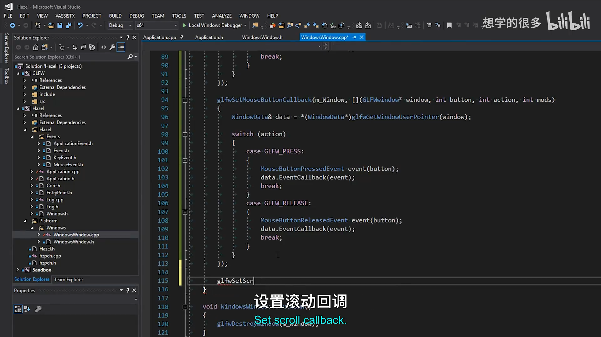

### 6.6 鼠标移动

鼠标移动回调同样提供两个 `double`，转换后构造 `MouseMovedEvent`：

```cpp
glfwSetCursorPosCallback(m_Window,
    [](GLFWwindow* window, double xPos, double yPos)
    {
        WindowData& data =
            *(WindowData*)glfwGetWindowUserPointer(window);

        MouseMovedEvent event(
            (float)xPos,
            (float)yPos);
        data.EventCallback(event);
    });
```

鼠标坐标以窗口客户区为参考，不是全局屏幕坐标。

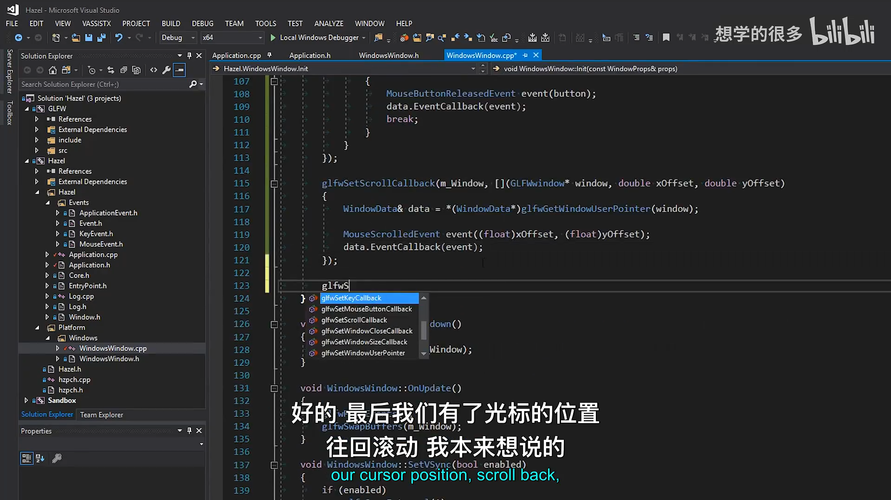

## 7. GLFW 错误回调

*(参考时间: 00:15:59)*

GLFW 还可以注册全局错误回调。本讲在第一次初始化 GLFW 后设置：

```cpp
glfwSetErrorCallback(GLFWErrorCallback);
```

错误回调是一个静态函数：

```cpp
static void GLFWErrorCallback(int error, const char* description)
{
    HZ_CORE_ERROR("GLFW Error ({0}): {1}",
                  error,
                  description);
}
```

它不是窗口事件，而是 GLFW 内部的错误报告机制。把它接入 Hazel 日志后，初始化或运行期间的问题会与其他核心日志出现在同一控制台。

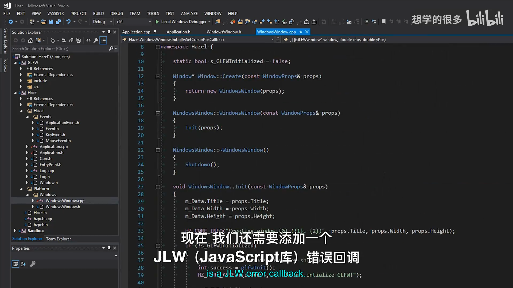

## 8. 第一次运行：所有事件进入日志

*(参考时间: 00:17:20)*

运行应用后，`Application::OnEvent` 会记录：

- 鼠标移动时的坐标；
- 鼠标按钮按下与释放；
- 键盘按下和释放；
- 按住按键时 `KeyPressedEvent` 的重复计数为 `1`；
- 滚轮偏移；
- 窗口缩放后的宽高；
- 关闭窗口时的 `WindowCloseEvent`。

这说明 GLFW 原生回调和 Hazel 事件系统已经完整连通，而不是只注册了回调却没有派发。

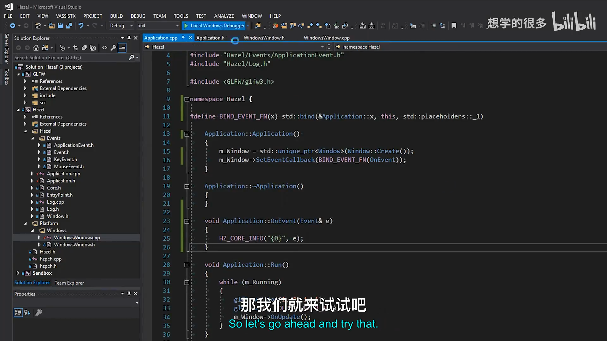

## 9. 用 EventDispatcher 处理关闭事件

*(参考时间: 00:18:24)*

事件已经能到达 `Application`，接下来使用上一讲实现的 `EventDispatcher` 筛选具体类型。

### 9.1 创建关闭处理函数

```cpp
bool Application::OnWindowClose(WindowCloseEvent& e)
{
    m_Running = false;
    return true;
}
```

返回 `true` 表示事件已经被处理。主循环下一次检查 `m_Running` 时会退出。

### 9.2 注册分发分支

```cpp
void Application::OnEvent(Event& e)
{
    EventDispatcher dispatcher(e);
    dispatcher.Dispatch<WindowCloseEvent>(
        BIND_EVENT_FN(OnWindowClose));

    HZ_CORE_TRACE("{0}", e);
}
```

`Dispatch<WindowCloseEvent>` 内部会：

1. 比较传入事件的运行时类型；
2. 取得模板类型 `WindowCloseEvent::GetStaticType()`；
3. 类型匹配时调用绑定函数；
4. 用函数返回值设置事件的 `m_Handled`。

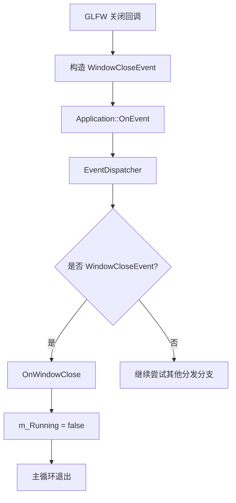

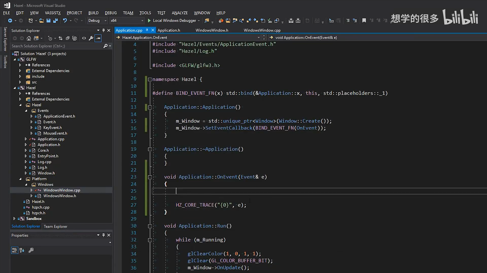

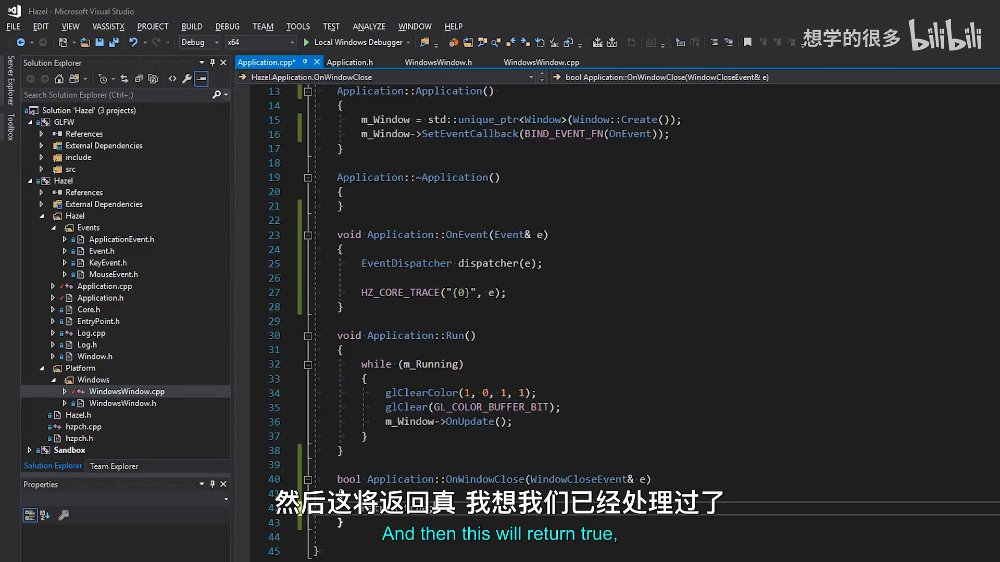

构建时出现过“不认识 `WindowCloseEvent`”的错误，原因是 `Application.h` 的声明需要具体类型定义。把 `ApplicationEvent.h` 放到头文件包含路径后即可正常编译。

## 10. 关闭按钮验证

*(参考时间: 00:21:03)*

再次运行程序后：

- 鼠标移动事件持续输出；
- 键盘和鼠标按钮事件正常；
- 滚轮和窗口缩放正常；
- 点击关闭按钮后，`WindowCloseEvent` 被分发到 `OnWindowClose`；
- `m_Running` 变为 `false`，主循环退出，应用关闭。

这证明完整链路已经成立：

```text
GLFW 原生关闭回调
  -> WindowCloseEvent
  -> EventCallback
  -> Application::OnEvent
  -> EventDispatcher::Dispatch<WindowCloseEvent>
  -> Application::OnWindowClose
  -> m_Running = false
```

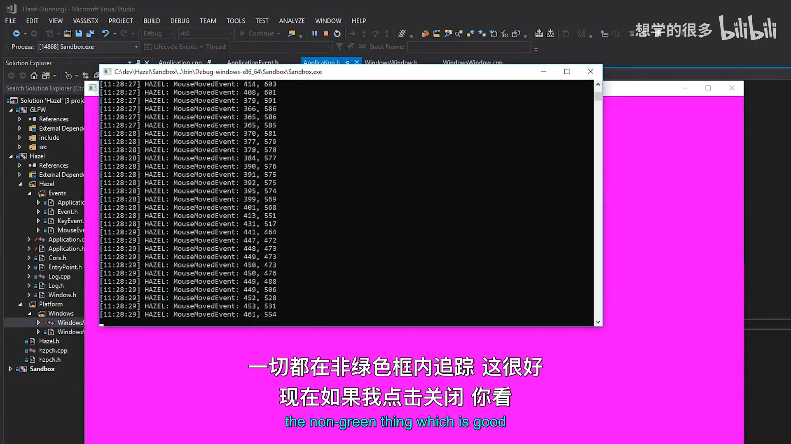

## 11. 当前设计边界

本节让窗口事件完整进入 Hazel，但仍有几项等待后续处理。

第一，键盘事件直接携带 GLFW 键码。成熟的跨平台引擎需要把 GLFW 键码转换成 Hazel 自己的键码枚举。

第二，当前系统是事件通知机制。应用无法直接询问“某个按键当前是否按下”，这需要额外的输入状态轮询接口，而不能仅靠事件回调完成。

第三，所有事件目前先到达 `Application::OnEvent`。未来引入 Layer Stack 后，应用会把事件继续传播给各层，并通过 `m_Handled` 决定是否停止传播。

第四，`WindowsWindow` 使用原始指针样式把 `GLFWwindow*` 和 `WindowData*` 进行转换。当前类型控制在一个文件内没有问题，但后续可以使用更安全的包装或辅助函数减少 C 风格转换。

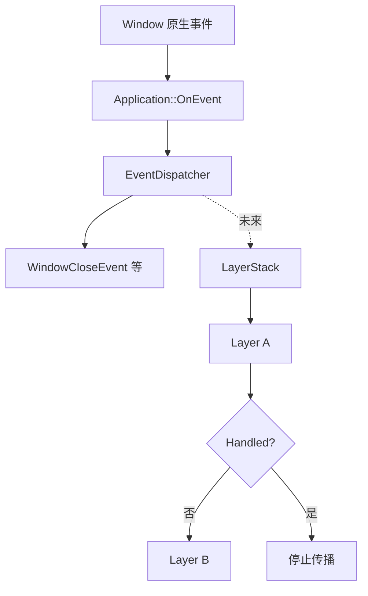

## 12. 本节结论

这一讲把前面三个独立部分真正组合了起来：

- 抽象 `Window` 提供事件回调接口；
- `WindowsWindow` 注册 GLFW 原生回调并构造 Hazel 事件；
- `Application` 使用 `EventDispatcher` 处理关闭事件；
- `m_Running` 控制主循环生命周期。

至此，Hazel 已经拥有一套可以工作的端到端窗口事件系统。窗口大小、关闭、键盘、鼠标按钮、滚轮和鼠标移动都能形成类型明确的事件，并交给应用处理。下一阶段可以把事件继续传给 Layer Stack，并补上输入轮询，使引擎能够回答按键和鼠标的持续状态。

## 附：官方参考

- [Bilibili 精译视频：012 - 窗口事件](https://www.bilibili.com/video/BV1wtLazEEmC/?p=12)
- [The Cherno 游戏引擎系列播放列表](https://www.youtube.com/playlist?list=PLlrATfBNZ98dC-V-N3m0Go4deliWHPFwT5)
- [The Cherno 的 Hazel 仓库](https://github.com/TheCherno/Hazel)
- [本期对应代码提交 `30516ad`](https://github.com/TheCherno/Hazel/tree/30516ad7109b016213eb732f14e1c7061c1db603)
