# Hazel 游戏引擎笔记 013：图层与 LayerStack

> 本节来源：[The Cherno 游戏引擎系列第 13 讲“图层”](https://www.bilibili.com/video/BV1wtLazEEmC/?p=13)，时长约 22 分 59 秒。  
> 原课程与 Hazel 代码作者：The Cherno。代码参考提交：[`5bd8093`](https://github.com/TheCherno/Hazel/tree/5bd809312a266c23d13d84dcd08a833a526aa264)。  
> 本文由视频字幕重构、翻译并整理，不是官方教材；术语和代码以原视频及同期 Hazel 仓库为准。

## 本节目标

上一讲把 GLFW 窗口事件接入了 Hazel。本节引入一个新的基础抽象：**Layer**，以及负责管理多个 Layer 的 **LayerStack**。

Layer 不只是绘制顺序。它同时影响：

- 每帧更新顺序；
- 渲染顺序；
- 事件接收顺序；
- 应用不同功能模块的边界；
- 事件是否继续向下一层传播。

本节会实现：

- `Layer` 的生命周期与更新、事件虚函数；
- `LayerStack` 的普通层和 Overlay 插入规则；
- `Application` 对 LayerStack 的拥有与转发；
- `PushLayer()`、`PushOverlay()` 和反向事件传播；
- 客户端 `ExampleLayer`；
- 修复 DLL 与 Sandbox 使用不同 C++ 运行时堆导致的崩溃问题。

## 1. Layer 是什么

*(参考时间: 00:01:18)*

Cherno 用 Photoshop 图层作类比：图层可以理解为一个有序集合，每一层包含一部分内容，顺序决定它们如何叠加。

在游戏引擎中，Layer 通常是一个相对独立的应用模块，例如：

- 3D 游戏世界层：保存场景并执行主要渲染；
- 游戏调试层：绘制碰撞区域、命中框和调试几何体；
- UI 层：使用正交投影绘制按钮、菜单和 HUD；
- 调试 UI 层：承载 ImGui 等工具界面；
- 编辑器和工具层：仅在开发或内部构建中启用。

Layer 是一个抽象概念。它本身不规定“必须绘制什么”或“必须处理什么事件”，而是提供统一的调用入口，由子类决定具体行为。

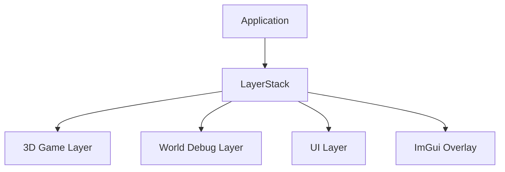

## 2. 更新与事件使用相反的顺序

*(参考时间: 00:02:11)*

LayerStack 是一个有序列表。Update 和渲染从底部到顶部，也就是从 `begin()` 到 `end()`：

```text
底层游戏世界
  -> 世界调试层
  -> UI 层
  -> Overlay
```

这样后面的层可以覆盖前面层绘制的内容。Overlay 永远排在普通层之后，因此最后渲染并显示在最上方。

事件传播方向相反。鼠标点击最先落到用户看到的顶层，因此事件从 `end()` 向 `begin()` 反向传播：

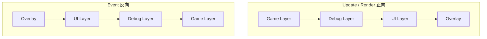

如果一个 UI 按钮已经处理了点击事件，事件会标记为 `Handled`，传播立即停止，游戏世界不会再把同一次点击当成开火、选择或其他操作。这正是 LayerStack 对事件顺序最实用的价值。

## 3. Layer 接口

*(参考时间: 00:08:07)*

`Layer.h` 定义一个可供客户端继承的基类：

```cpp
class HAZEL_API Layer
{
public:
    Layer(const std::string& name = "Layer");
    virtual ~Layer();

    virtual void OnAttach() {}
    virtual void OnDetach() {}
    virtual void OnUpdate() {}
    virtual void OnEvent(Event& event) {}

    inline const std::string& GetName() const
    {
        return m_DebugName;
    }

protected:
    std::string m_DebugName;
};
```

### 3.1 DebugName

名字只是调试标识，默认是 `"Layer"`。Layer 不应该依靠名字互相查找或通信；模块之间应使用明确的 API 或事件。

### 3.2 生命周期

`OnAttach()` 和 `OnDetach()` 类似初始化与清理：

- Layer 被加入应用并开始参与运行时调用 `OnAttach()`；
- Layer 被移出应用时调用 `OnDetach()`。

### 3.3 每帧更新

`OnUpdate()` 由应用的主循环调用，通常每帧一次。游戏逻辑、动画更新和渲染都可以从这里进入。

### 3.4 事件入口

`OnEvent(Event&)` 接收窗口和其他模块产生的事件。若某个 Layer 处理了事件，应通过 `EventDispatcher` 把事件标记为已处理。

所有回调默认都是空实现，子类只重写需要的部分。

实现文件负责保存调试名：

```cpp
Layer::Layer(const std::string& debugName)
    : m_DebugName(debugName)
{
}

Layer::~Layer()
{
}
```

虚析构函数是必需的，因为 Layer 通常通过基类指针销毁。

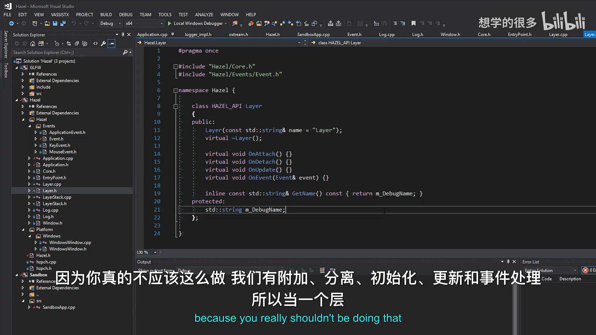

### 3.5 暂未加入启停功能

视频讨论了 Layer 的启用和禁用：可以给 Layer 或 LayerStack 增加布尔状态，使禁用层不更新、不渲染，也不接收事件。但本节故意没有加入，以免一次引入过多复杂度。

## 4. LayerStack 数据结构

*(参考时间: 00:10:49)*

LayerStack 本质上封装了 `std::vector<Layer*>`：

```cpp
class HAZEL_API LayerStack
{
public:
    LayerStack();
    ~LayerStack();

    void PushLayer(Layer* layer);
    void PushOverlay(Layer* overlay);
    void PopLayer(Layer* layer);
    void PopOverlay(Layer* overlay);

    std::vector<Layer*>::iterator begin()
    {
        return m_Layers.begin();
    }

    std::vector<Layer*>::iterator end()
    {
        return m_Layers.end();
    }

private:
    std::vector<Layer*> m_Layers;
    std::vector<Layer*>::iterator m_LayerInsert;
};
```

为什么使用 `vector`，而不是真正的栈？

- 每帧需要从底到顶顺序遍历；
- 事件需要反向遍历；
- Overlay 要插入到普通层之后，而不是简单压入栈顶；
- 连续存储有利于频繁迭代。

`m_LayerInsert` 指向“普通层区域”的下一个插入位置，也就是普通层和 Overlay 的分界。

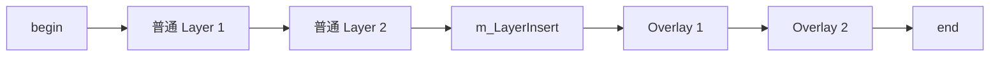

### 4.1 插入普通层

```cpp
void LayerStack::PushLayer(Layer* layer)
{
    m_LayerInsert =
        m_Layers.emplace(m_LayerInsert, layer);
}
```

`emplace()` 在分界位置插入新 Layer，并返回指向新元素的迭代器。因此再添加普通层时仍会插在 Overlay 之前。

### 4.2 插入 Overlay

```cpp
void LayerStack::PushOverlay(Layer* overlay)
{
    m_Layers.emplace_back(overlay);
}
```

Overlay 总是追加到最末尾。无论普通层何时加入，Overlay 都保持在最后并优先接收事件。

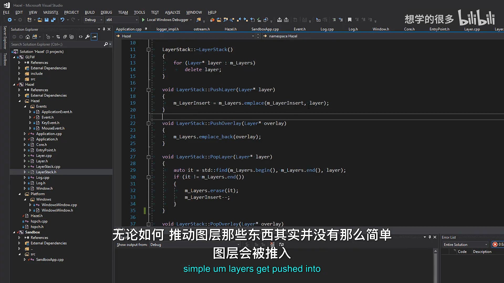

## 5. Layer 的所有权

*(参考时间: 00:12:04)*

LayerStack 接收的是原始指针，并拥有加入其中的 Layer：

```cpp
LayerStack::~LayerStack()
{
    for (Layer* layer : m_Layers)
        delete layer;
}
```

所有权语义如下：

- Layer 一旦加入 LayerStack，由 LayerStack 负责最终释放；
- `PopLayer()` 或 `PopOverlay()` 只是从列表移除，不立即删除对象；
- 被弹出的 Layer 可以在之后再次加入；
- 整个 LayerStack 销毁时，所有仍在列表中的 Layer 都会被删除；
- LayerStack 是 `Application` 的成员，因此其生命周期跟随应用。

这意味着当前设计默认 Layer 通常存活到应用结束。未来切换场景或编辑器模式时，可能选择重建整个 LayerStack，而不是频繁弹出并单独销毁 Layer。

弹出普通层时需要恢复插入位置：

```cpp
void LayerStack::PopLayer(Layer* layer)
{
    auto it = std::find(m_Layers.begin(),
                       m_Layers.end(),
                       layer);
    if (it != m_Layers.end())
    {
        m_Layers.erase(it);
        m_LayerInsert--;
    }
}
```

Overlay 的弹出不会改变普通层分界：

```cpp
void LayerStack::PopOverlay(Layer* overlay)
{
    auto it = std::find(m_Layers.begin(),
                       m_Layers.end(),
                       overlay);
    if (it != m_Layers.end())
        m_Layers.erase(it);
}
```

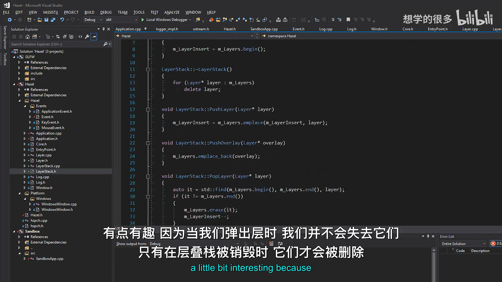

## 6. 在 Application 中接入 LayerStack

*(参考时间: 00:14:46)*

`Application` 增加 LayerStack 成员和两个转发函数：

```cpp
void PushLayer(Layer* layer);
void PushOverlay(Layer* layer);

private:
    LayerStack m_LayerStack;
```

```cpp
void Application::PushLayer(Layer* layer)
{
    m_LayerStack.PushLayer(layer);
}

void Application::PushOverlay(Layer* layer)
{
    m_LayerStack.PushOverlay(layer);
}
```

因为 LayerStack 是 `Application` 的普通成员，它和应用程序拥有相同生命周期。当前应用只提供 Push，不提供 Pop；先提供一个最小可用版本，后续再扩展。

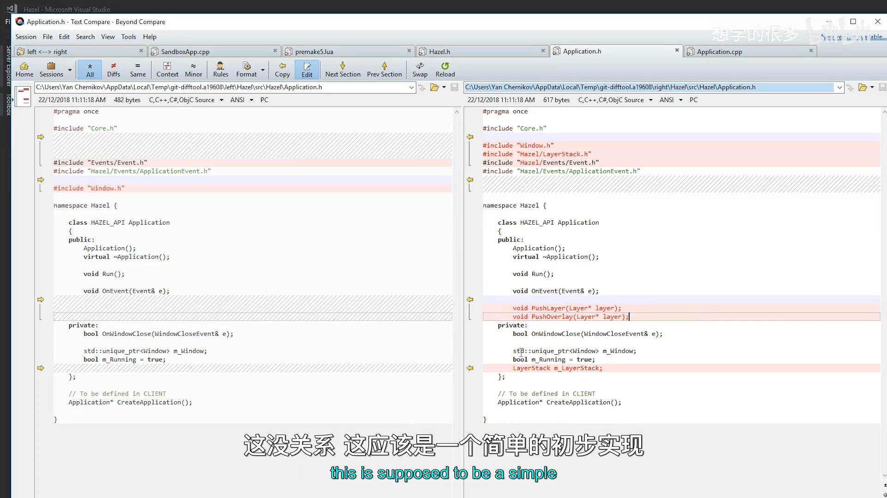

## 7. Update 正向遍历

*(参考时间: 00:15:27)*

主循环从第一个 Layer 遍历到最后一个：

```cpp
for (Layer* layer : m_LayerStack)
    layer->OnUpdate();
```

这里能使用范围循环，是因为 LayerStack 提供了 `begin()` 和 `end()`。遍历顺序为：

```text
普通层 -> 更靠上的普通层 -> Overlay
```

Overlay 的 Update 也会执行，并且由于位置在最后，它有机会覆盖或修饰之前层的结果。

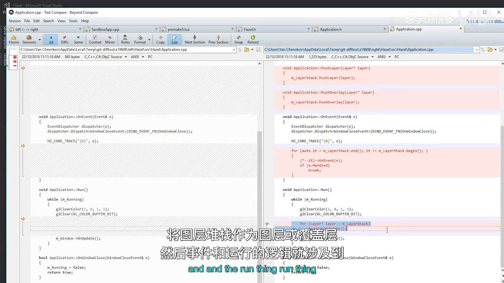

## 8. Event 反向遍历与停止传播

*(参考时间: 00:15:47)*

`Application::OnEvent()` 先处理应用级关闭事件，再从 LayerStack 末尾开始向前：

```cpp
for (auto it = m_LayerStack.end();
     it != m_LayerStack.begin();)
{
    (*--it)->OnEvent(e);
    if (e.Handled)
        break;
}
```

循环没有在每次迭代后自动递减，而是先用 `--it` 指向前一个有效元素。这样可以安全地从 `end()` 反向访问。

事件传播规则：

1. Overlay 最先收到事件；
2. 随后是普通 UI、调试层和游戏层；
3. 任意 Layer 把事件标记为 `Handled`；
4. 循环立即 `break`，更低层不再收到该事件。

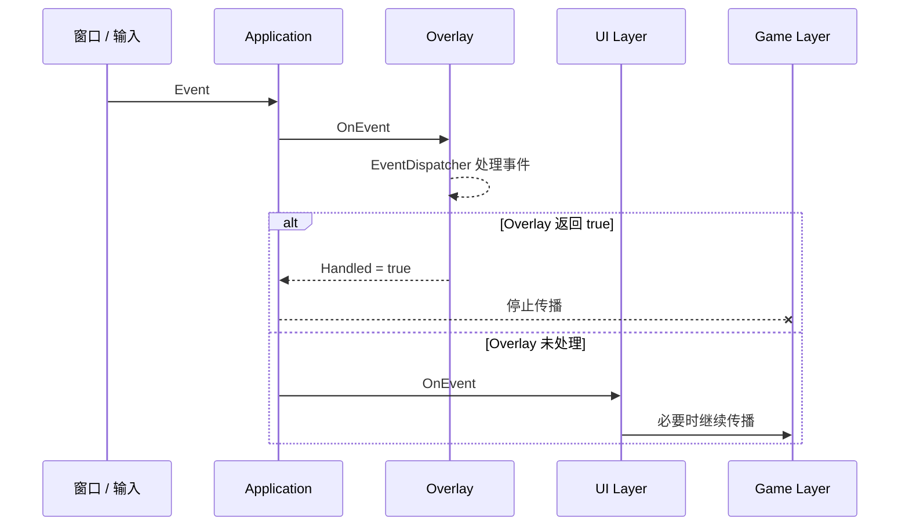

视频中的典型例子是第一人称射击游戏：如果点击事件被屏幕按钮处理，就不应继续到游戏层并触发开枪。

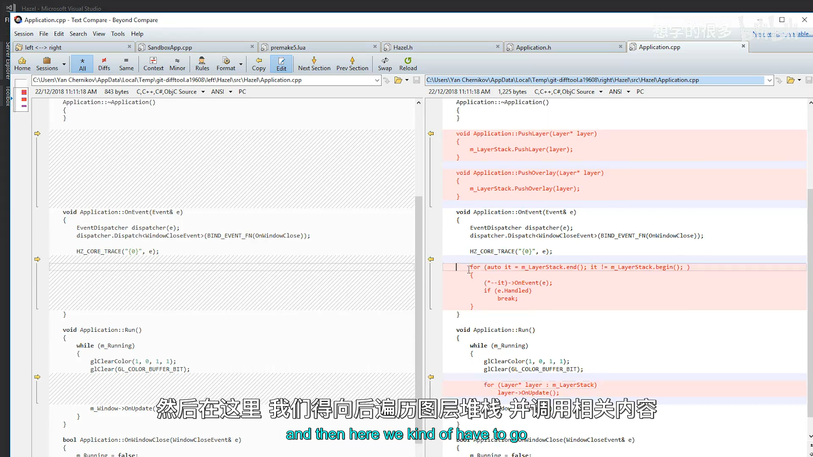

## 9. 客户端公开头文件

*(参考时间: 00:16:08)*

`Hazel.h` 增加 `Layer.h`：

```cpp
#include "Hazel/Application.h"
#include "Hazel/Layer.h"
#include "Hazel/Log.h"
```

`Application.h` 已经间接包含 LayerStack，但 Layer 是客户端最常使用的类型之一，因此在公开头文件中显式包含，使用更直观。

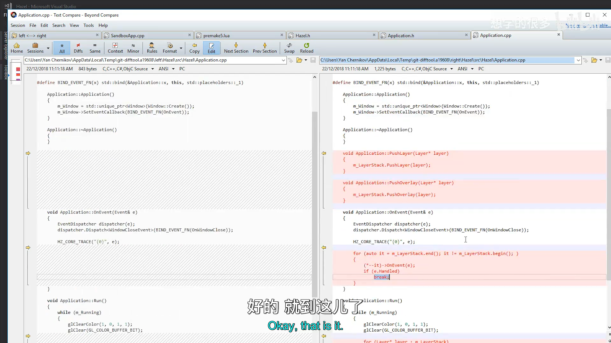

## 10. 修复 DLL 与 Sandbox 的运行时堆问题

*(参考时间: 00:16:28)*

构建 DLL 时，如果 Hazel 和 Sandbox 分别静态链接 C++ 运行时库，二者会拥有不同的堆。跨 DLL 边界释放对方分配的内存时，可能访问错误堆并崩溃。

视频中，这个问题在 spdlog 释放内存时暴露出来。修复方式是让两个项目都使用多线程 DLL 版本的运行时库：

- Debug 使用 `MDd`；
- Release 使用 `MD`。

Premake 中增加对应配置。这样 Hazel DLL 与 Sandbox 共享兼容的运行时运行时环境，不再跨堆释放内存。

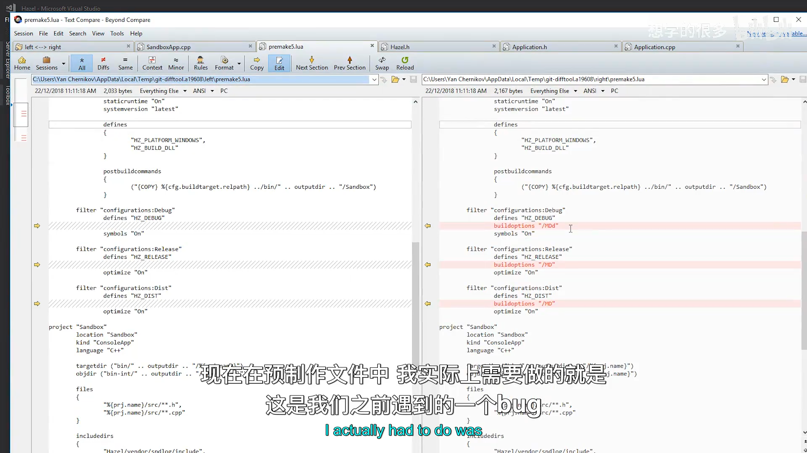

## 11. 创建 ExampleLayer

*(参考时间: 00:18:39)*

客户端只需要继承 `Hazel::Layer`：

```cpp
class ExampleLayer : public Hazel::Layer
{
public:
    ExampleLayer()
        : Layer("Example")
    {
    }

    void OnUpdate() override
    {
        HZ_INFO("ExampleLayer::Update");
    }

    void OnEvent(Hazel::Event& event) override
    {
        HZ_TRACE("{0}", event);
    }
};
```

`Sandbox` 构造函数把 ExampleLayer 推入应用：

```cpp
class Sandbox : public Hazel::Application
{
public:
    Sandbox()
    {
        PushLayer(new ExampleLayer());
    }
};
```

如果要让它永远显示在普通层上方，也可以使用 `PushOverlay(new ExampleLayer())`。

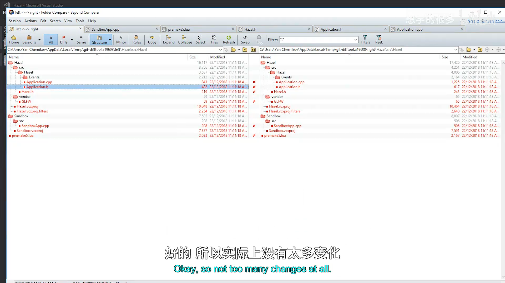

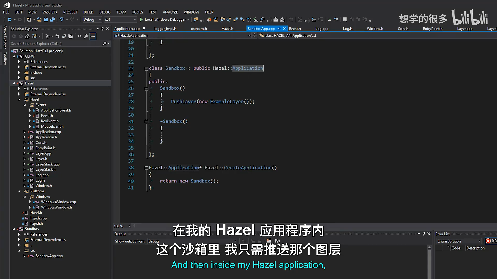

## 12. 运行结果

*(参考时间: 00:20:01)*

运行后可以看到：

- Example Layer 每帧输出 `ExampleLayer::Update`；
- 移动鼠标、按键或操作窗口时，Example Layer 收到事件；
- Hazel 核心日志先记录事件，Example Layer 随后记录事件；
- 如果移除 `Application::OnEvent` 中的核心 Trace，则只保留层自身的事件日志；
- 关闭按钮仍由应用级 `WindowCloseEvent` 处理并结束主循环。

这展示了 Layer 已经成为游戏逻辑与事件处理的实际接收点，而 `Application` 负责统一调度和生命周期。

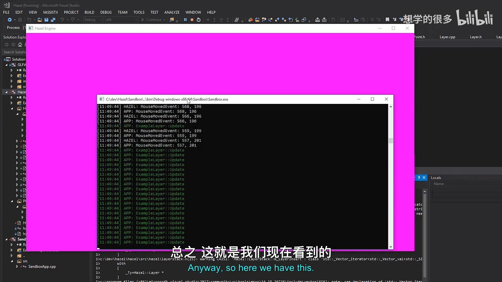

## 13. 后续方向

*(参考时间: 00:20:35)*

下一步计划是为 Hazel 接入 ImGui，并创建 `ImGuiLayer`：

- 接收 ImGui 需要的事件；
- 负责 ImGui 的渲染；
- 使用 Overlay 身份保持在普通层上方。

再往后，3D 世界和 2D UI 也会分别拥有自己的 Layer。届时 LayerStack 将成为 Hazel 运行时的基本组织单位：

```text
Application
  -> 管理主循环、窗口和 LayerStack
Layer
  -> 更新、渲染和接收事件
LayerStack
  -> 确定更新顺序、渲染顺序和事件传播顺序
```

## 14. 本节结论

本讲建立了 Hazel 的 Layer 系统：

- `Layer` 是客户端可继承的应用模块；
- `LayerStack` 用 `vector` 管理层和 Overlay；
- 普通层始终插在 Overlay 之前；
- Update 从底到顶执行；
- Event 从顶到底传播并在 `Handled` 后停止；
- LayerStack 拥有 Layer 的最终生命周期；
- `Application` 提供 PushLayer、PushOverlay 并驱动更新与事件；
- 客户端可以通过 `ExampleLayer` 扩展引擎行为。

Layer 和 LayerStack 看似代码很少，却是后续编辑器、UI、渲染器和工具系统的基础。引擎主循环负责稳定的运行时骨架，具体功能则以 Layer 的形式插入其中。

## 附：官方参考

- [Bilibili 精译视频：013 - 图层](https://www.bilibili.com/video/BV1wtLazEEmC/?p=13)
- [The Cherno 游戏引擎系列播放列表](https://www.youtube.com/playlist?list=PLlrATfBNZ98dC-V-N3m0Go4deliWHPFwT5)
- [The Cherno 的 Hazel 仓库](https://github.com/TheCherno/Hazel)
- [本期对应代码提交 `5bd8093`](https://github.com/TheCherno/Hazel/tree/5bd809312a266c23d13d84dcd08a833a526aa264)
